<div align="center">


[](https://www.postgresql.org/)
[](https://www.npmjs.com/)
[](https://nodejs.org/en)
[](https://expressjs.com/it/)
[](https://jwt.io/)
[](https://code.visualstudio.com/)
[](https://www.typescriptlang.org/)
[](https://sequelize.org/)
[](https://www.docker.com/)
[](https://www.postman.com/)

</div>

## Indice

- [Obiettivi del Progetto](#obiettivi-del-progetto)
- [Progettazione](#progettazione)
- [Funzionamento](#funzionamento)
- [Testing](#testing)
- [Autori](#autori)

## Obiettivi del Progetto
#### Descrizione del progetto:
Le specifiche del progetto sono state fornite dal professore [*Adriano Mancini*](https://github.com/manciniadriano):

*Si realizzi un sistema che consenta di gestire la creazione e valutazione di modelli di ottimizzazione su grafo. In particolare, il sistema deve prevedere la possibilità di gestire l’aggiornamento di pesi effettuato da utenti autenticati (mediante JWT). Il progetto simula il concetto del crowd-sourcing dove gli utenti possono contribuire attivamente. Un esempio di applicazione è quello di tenere traccia dei minuti che sono necessari per percorre un determinato tratto di strada. Di seguito il dettaglio di quanto si deve realizzare (tutte le chiamate devono essere autenticate con JWT):*

- *Dare la possibilità di creare un nuovo modello seguendo l’interfaccia definita nella sezione API di [node-dijkstra](https://www.npmjs.com/package/node-dijkstra) ed in particolare di specificare il grafo con i relativi pesi.*
  - *È necessario validare la richiesta di creazione del modello.*
  - *Per ogni modello valido deve essere addebitato un numero di token in accordo con quanto segue:*
    - *0.10 per ogni nodo.*
    - *0.02 per ogni arco.*
  - *Il modello può essere creato se c’è credito sufficiente adesaudire la richiesta.*

- *Dare la possibilità di aggiornare un modello cambiando il peso per uno o più archi; si distinguano due casi:*
  - *Utente che fa richiesta di aggiornamento che coincide con l’utente che ha creato il modello.*
    - *In questo caso la richiesta se valida consente di avere una versione differente dall’ultima utilizzata.*
  - *Utente che fa richiesta di aggiornamento che NON coincide con l’utente che ha creato il modello.*
    - *In questo caso la richiesta deve essere approvata o rifiutata dall’utente che ha creato il modello.*
    - *Creare una rotta per approvare o rigettare una data richiesta di aggiornamento.*
  - *La richiesta di aggiornamento costa 0.025 per ogni arco che si vuole aggiornare; rifiutare se il credito non è sufficiente. L’importo viene sottratto all’utente che sta facendo la richiesta.*

- *Per ogni nuova richiesta approvata si proceda con aggiornare il peso dell’arco mediante una media esponenziale del tipo **p(i,j) = alpha * p(i,j) + (1 – alpha) * p_new(i,j)** dove **p(i,j)** è il precedente costo associato all’arco che collega nodi i-j e **p_new** è il nuovo costo suggerito dall’utente. alpha è uguale per tutti i modelli e deve essere gestito mediante una variabile di env. alpha deve essere > 0 e < 1; valori errati nella variabile di env devono determinare l’avvio del sistema con una configurazione pari ad alpha = 0.8*

- *Creare una rotta che dato un modello consenta di restituire l’elenco degli aggiornamenti effettuati nel corso del tempo filtrando opzionalmente per data (inferiore a, superiore a, compresa tra) distinguendo per stato ovvero accettato / rigettato.*

- *Creare una rotta che consenta di verificare lo stato di un modello ovvero se vi è una richiesta in fase di pending.*

- *Creare una rotta che consenta di visualizzare tutte le richieste di aggiornamento che sono in fase pending relative a modelli creati dall’utente che si autentica mediante token JWT.*

- *Creare una rotta che consenta di approvare / rigettare la richiesta di aggiornamento peso; solo l’utente che ha creato il modello può effettuare tale operazione (l’operazione può essere fatta anche in modalità bulk specificando quali richieste approvare o meno).*

- *Eseguire un modello fornendo un nodo di partenza ed uno di arrivo; per ogni esecuzione deve essere applicato un costo pari a quello addebitato nella fase di creazione. Ritornare il risultato sotto forma di JSON. Il risultato deve anche considerare il tempo impiegato per l’esecuzione. Ritornare il percorso ed il costo associato a tale percorso (per costo si intende non i termini di token, ma in termini di percorso ottimo sul grafo considerando i pesi).*

- *Restituire l’elenco degli aggiornamenti in formato JSON, CSV, PDF o XML dei pesi di un dato modello eventualmente filtrando per data specificando o la data di fine, o la data di inizio o entrambe.*

- *Effettuare una “simulazione” che consenta di variare il peso relativo ad un arco specificando il valore di inizio, fine ed il passo di incremento (es. start = 1 stop = 2 e passo 0.05).*
  - *Le richieste di simulazione devono essere validate (es. range non ammissibili).*
  - *È necessario ritornare l’elenco di tutti i risultati; ritornare anche il best result con la relativa configurazione dei pesi che sono stati usati. Restituire i dati sotto forma di JSON o PDF. Le richieste devono essere validate.*

*Si chiede di sviluppare il codice possibilmente utilizzando TypeScript. Ogni utente autenticato (ovvero con JWT) ha un numero di token (valore iniziale impostato nel seed del database). Nel caso di token terminati ogni richiesta da parte dello stesso utente deve restituire 401 Unauthorized.*

*Prevedere una rotta per l’utente con ruolo admin che consenta di effettuare la ricarica per un utente fornendo la mail ed il nuovo “credito” (sempre mediante JWT). I token JWT devono contenere i dati essenziali.*

*Il numero residuo di token deve essere memorizzato nel db sopra citato. Si deve prevedere degli script di seed per inizializzare il sistema. Nella fase di dimostrazione (demo) è necessario prevedere almeno 2 modelli diversi con almeno due versioni con una complessità minima di 8 nodi e 16 archi.*

*Si chiede di utilizzare le funzionalità di middleware.*

*Si chiede di gestire eventuali errori mediante gli strati middleware sollevando le opportune eccezioni.*

*Si chiede di commentare opportunamente il codice.*


## Progettazione

### Diagrammi UML


## API Routes

| Metodo | Rotta                          | Parametri                                                                                       | Descrizione                                                                                             |
|--------|--------------------------------|-------------------------------------------------------------------------------------------------|---------------------------------------------------------------------------------------------------------|
| `GET`  | `/`                            | Nessuno                                                                                         | Pagina di benvenuto, invita a effettuare il login.                                                      |
| `POST` | `/login`                       | email, password                                                                                 | Effettua il login e restituisce il JWT associato all'utente.                                            |
| `POST` | `/register`                    | email, password                                                                                 | Registra un nuovo utente.                                                                               |
| `GET`  | `/user/tokens`                 | JWT nel header                                                                                  | Restituisce i token associati ad un utente.                                                             |
| `PUT`  | `/recharge`                    |  email, tokens                                                                   | Modifica i token di un utente.                                                                          |
| `POST` | `/graph`                       |  name, description, nodes, edges                                                 | Crea un nuovo grafo.                                                                                    |
| `GET`  | `/graph/calculatecost`         |  graphId, startNode, endNode                                                     | Calcola il percorso minimo tra due nodi di un grafo.                                                    |
| `GET`  | `/graphslist`                  | JWT nel header                                                                                  | Ottiene tutta la lista dei grafi.                                                                       |
| `GET`  | `/graph/edges`                 |  graphId                                                                         | Ottiene la lista degli archi di un grafo.                                                               |
| `GET`  | `/user/all`                    | JWT nel header                                                                                  | Ottiene tutti gli utenti (solo per admin).                                                              |
| `GET`  | `/updates/graph/pending`       |  graphId                                                                         | Visualizza gli aggiornamenti pendenti per un modello.                                                   |
| `GET`  | `/updates/user/pending`        | JWT nel header                                                                                  | Visualizza gli aggiornamenti pendenti per un utente.                                                    |
| `PUT`  | `/update/answer`               |  updateId, answer                                                                | Approva o rifiuta una richiesta di aggiornamento.                                                       |
| `PUT`  | `/update/edges`                |  graphId, edgeId, newWeight                                                      | Aggiorna uno o più archi di un grafo.                                                                   |
| `GET`  | `/updates/history/graph`       |  graphId, dateFilter (from, to), status                                          | Restituisce l’elenco degli aggiornamenti effettuati nel tempo, filtrati per data e stato.               |
| `GET`  | `/updates/format`              |  graphId, dateFilter (from, to), status, format                                  | Ottiene gli aggiornamenti in formato specificato, filtrati per data e stato.                            |
| `GET`  | `/simulate`                    |  graphId, edgeId, startNode, endNode, startWeight, endWeight, step                | Simula variazioni di peso su un arco di un grafo, validando i parametri di simulazione.                 |

 **Nota:** Tutte le rotte hanno bisogno dell'autenticazione tramite JWT tranne le rotte */login* e */register*. 
 
 La rotta */user/all* può essere utilizzata solo dall'admin.

 ### Pattern Utilizzati

#### MVC (Model-View-Controller) Pattern
Il pattern MVC è un paradigma di progettazione software che separa l'applicazione in tre componenti principali: Modello (gestisce i dati e le regole del business), Vista (presenta i dati all'utente), e Controller (interpreta i comandi dell'utente, facendo da ponte tra Modello e Vista). Nel nostro progetto, abbiamo adottato un approccio M(V)C, dove la Vista non è direttamente implementata considerando la natura del backend, focalizzandoci su Modello e Controller per gestire dati e logica applicativa.

#### Singleton Pattern
Il pattern Singleton assicura che una classe abbia solo una istanza e fornisce un punto di accesso globale a questa istanza. È stato utilizzato per gestire la connessione al database, garantendo che la connessione sia unica e facilmente accessibile.

```javascript
// Singleton per la connessione al database
import { Sequelize } from 'sequelize';
import dotenv from 'dotenv';
dotenv.config();
const dbUsername = process.env.PGUSER || 'postgres';
const dbPassword = process.env.PGPASSWORD;
const dbName = process.env.PGDATABASEE || 'mydb';
const dbHost = process.env.PGHOST || 'db';
export class DbConnector {
    private static instance: DbConnector;
    private sequelizer: any;
    private constructor() {
        this.sequelizer = new Sequelize(dbName, dbUsername, dbPassword, { host: dbHost, dialect: 'postgres', });
    }
    public static getConnection(): any {
        if (!DbConnector.instance) {
            DbConnector.instance = new DbConnector();
        }
        return DbConnector.instance.sequelizer;
    }
}
```
#### Factory Pattern

Il pattern Factory è utilizzato per creare oggetti senza esplicitare la classe concreta che sarà istanziata. Questo permette di migliorare la modularità del codice rendendolo più flessibile e mantenibile. Nel nostro progetto, il Factory Pattern è impiegato per generare messaggi di risposta personalizzati basati sul codice di stato, facilitando la gestione delle risposte HTTP in diverse situazioni.

```javascript
export class MessageFactory {
    constructor() { };

    static getStatusMessage(cases: CustomStatusCodes, res: Response, message: string) {
        switch (cases) {
            case CustomStatusCodes.BAD_REQUEST:
                return BadRequestMessage.setStatus(res, message);
            case CustomStatusCodes.UNAUTHORIZED:
                return UnauthorizedMessage.setStatus(res, message);
            case CustomStatusCodes.INTERNAL_SERVER_ERROR:
                return InternalServerErrorMessage.setStatus(res, message);
            case CustomStatusCodes.NOT_FOUND:
                return NotFoundErrorMessage.setStatus(res, message);
            case CustomStatusCodes.OK:
                return OkMessage.setStatus(res, message);
            default:
                return res.status(CustomStatusCodes.INTERNAL_SERVER_ERROR).json({ error: "Internal Server Error" });
        }
    }
}
```

```javascript
/**
 * Implementazione delle interfacce per la gestione dei messaggi di stato
 * Imposta il messaggio di stato sulla risposta HTTP con il codice di stato corrispondente.
 */

// Esempio di classe di messaggio modificata
export class BadRequestMessage {
    static setStatus(res: Response, message: string) {
        res.status(CustomStatusCodes.BAD_REQUEST).json({ message });
    }
}

export class UnauthorizedMessage {
    static setStatus(res: Response, message: string) {
        res.status(CustomStatusCodes.UNAUTHORIZED).json({ message });
    }
}

/**
 * Classe che rappresenta un messaggio di errore interno del server.
 */
export class InternalServerErrorMessage {
    /**
     * Imposta lo stato della risposta e restituisce un oggetto JSON contenente il messaggio di errore.
     * @param res - L'oggetto Response per impostare lo stato e inviare la risposta.
     * @param message - Il messaggio di errore da includere nell'oggetto JSON.
     */
    static setStatus(res: Response, message: string) {
        res.status(CustomStatusCodes.INTERNAL_SERVER_ERROR).json({ message });
    }
}

export class NotFoundErrorMessage {
    static setStatus(res: Response, message: string) {
        res.status(CustomStatusCodes.NOT_FOUND).json({ message });
    }
}

export class OkMessage {
    static setStatus(res: Response, message: string) {
        res.status(CustomStatusCodes.OK).json({ message });
    }
}
```
#### Chain of Responsibility Pattern

Il Chain of Responsibility Pattern permette di passare una richiesta lungo una catena di handler, dove ciascuno può gestirla o passarla al successivo. Questo pattern è utile per ridurre il coupling tra mittenti e destinatari di una richiesta, permettendo a più oggetti di tentare l'elaborazione.

Nel nostro contesto, viene applicato per la verifica del JWT nelle richieste HTTP, dove diversi controlli possono essere eseguiti in sequenza:

```javascript
/**
 * Controlla la validità del token JWT nell'intestazione della richiesta.
 * Verifica se il token JWT è presente e decodificabile correttamente.
 * Restituisce un errore 401 se il token JWT è mancante o non valido.
 *
 * @param req - Oggetto della richiesta HTTP.
 * @param res - Oggetto della risposta HTTP.
 * @param next - Funzione di callback per passare alla prossima operazione.
 */
export const checkJwt = (req: Request, res: Response, next: NextFunction) => {
    const jwtBearerToken = req.headers.authorization;
    const jwtDecode = jwtBearerToken ? decodeJwt(jwtBearerToken) : null;

    if (jwtDecode && jwtDecode.email && jwtDecode.password) {
        next();
    } else {
        return MessageFactory.getStatusMessage(CustomStatusCodes.UNAUTHORIZED, res, Messages400.Unauthorized);

    }
};
```


## Funzionamento
 
 In questa sezione, forniremo una descrizione dettagliata di ogni rotta che è stata creata. Saranno inclusi i parametri richiesti per ciascuna chiamata API, insieme a un diagramma delle sequenze per illustrare l'interazione tra i componenti del sistema. Questo approccio aiuterà a comprendere il flusso di dati e la logica dietro le operazioni eseguibili tramite l'API, offrendo anche dettagli sui risultati restituiti da ciascuna rotta.

### POST: /login

Per poter ottenere una risposta, il corpo delle richieste dovrà seguire il seguente modello:

```json
{
	"email":"alessandro@op.it",
	"password":"Opti2024!"
}
```

Il meccanismo che si innesca all'atto della chiamata è descritto dal seguente diagramma:

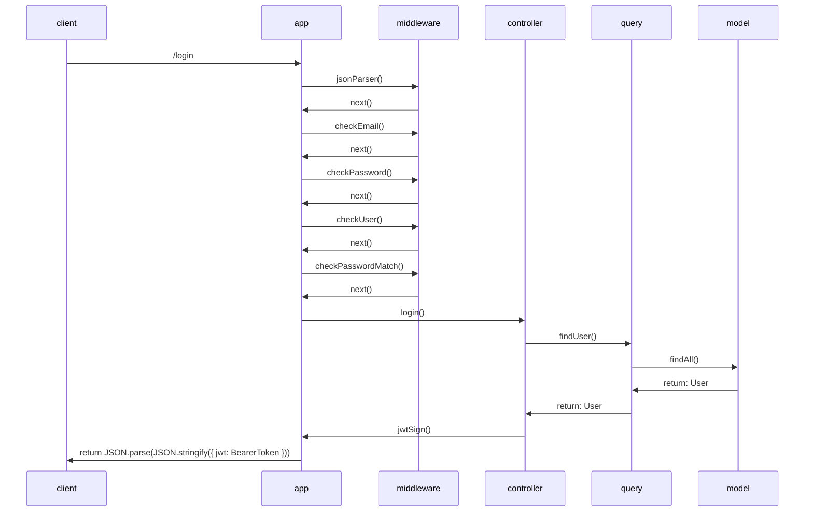
```mermaid
sequenceDiagram
    participant client
    participant app
    participant middleware
    participant controller
    participant query
    participant model

    client->>app: /login
    app->>middleware: jsonParser()
    middleware->>app: next()
    app->>middleware: checkEmail()
    middleware->>app: next()
    app->>middleware: checkPassword()
    middleware->>app: next()
    app->>middleware: checkUser()
    middleware->>app: next()
    app->>middleware: checkPasswordMatch()
    middleware->>app: next()
    app->>controller: login()
    controller->>query: findUser()
    query->>model: findAll()
    model->>query: return: User
    query->>controller: return: User
    controller->>app: jwtSign()
    app->>client: return JSON.parse(JSON.stringify({ jwt: BearerToken }))

```

Se la richiesta viene effettuata correttamente viene restituito il seguente messaggio:

```json
{
    "message": {
        "jwt": "MY_TOKEN_JWT"
    }
}
```
In caso di errore invece verrà restituito un messaggio che ha come chiave il nome del codice violato e un messaggio di errore a seconda della casistica. Inoltre, verrà settato lo stato a seconda dello status code:
```json
{
    "email":"adriano@op",
    "password":"Opti2024!"
}
```
Verrà generato il seguente errore:
```json
{
    status: 400 BAD REQUEST
    
    "message": "Il formato dell'email inserita non è corretto."

}
```
### POST: /register
Per poter ottenere una risposta, il corpo delle richieste dovrà seguire il seguente modello:
```json
́{
    "email":"prova@op.it",
    "password":"opti2024!"
}
```

Il meccanismo che si innesca all'atto della chiamata è descritto dal seguente diagramma:

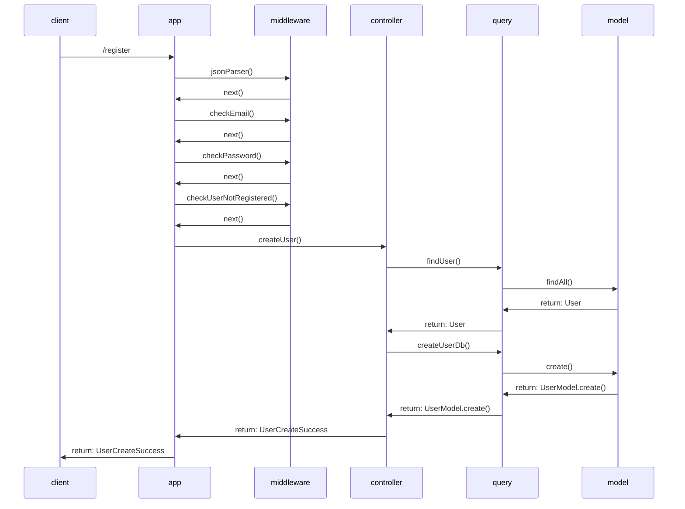
```mermaid
sequenceDiagram
    participant client
    participant app
    participant middleware
    participant controller
    participant query
    participant model

    client->>app: /register
    app->>middleware: jsonParser()
    middleware->>app: next()
    app->>middleware: checkEmail()
    middleware->>app: next()
    app->>middleware: checkPassword()
    middleware->>app: next()
    app->>middleware: checkUserNotRegistered()
    middleware->>app: next()
    app->>controller: createUser()
    controller->>query: findUser()
    query->>model: findAll()
    model->>query: return: User
    query->>controller: return: User
    controller->>query: createUserDb()
    query->>model: create()
    model->>query: return: UserModel.create()
    query->>controller: return: UserModel.create()
    controller->>app: return: UserCreateSuccess
    app->>client: return: UserCreateSuccess
```
Se la richiesta viene effettuata correttamente viene restituito il seguente messaggio:
```json
{
    "message": "Utente creato con successo."
}
```
In caso di errore invece verrà restituito un messaggio che ha come chiave il nome del codice violato e un messaggio di errore a seconda della casistica. Inoltre, verrà settato lo stato a seconda dello status code:
```json
{
    status: 400 BAD REQUEST
    "message": "Non è possibile creare l'utente perchè è già esistente."
}
```
### GET: /user/tokens
Per poter ottenere una risposta non è necessario inserire un body, basta aver fatto l'autenticazione tramite JWT.
Il meccanismo che si innesca all'atto della chiamata è descritto dal seguente diagramma:

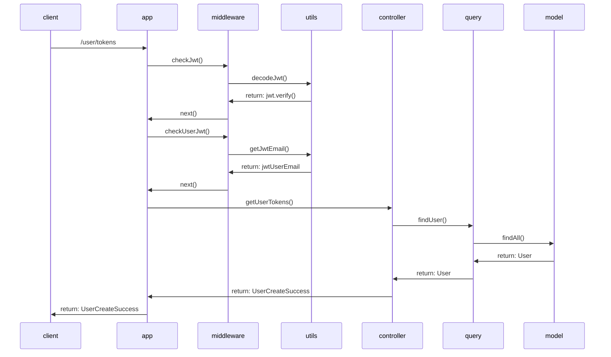
```mermaid
sequenceDiagram
    participant client
    participant app
    participant middleware
    participant utils
    participant controller
    participant query
    participant model

    client->>app: /user/tokens
    app->>middleware: checkJwt()
    middleware->>utils: decodeJwt()
    utils->>middleware: return: jwt.verify()
    middleware->>app: next()
    app->>middleware: checkUserJwt()
    middleware->>utils: getJwtEmail()
    utils->>middleware: return: jwtUserEmail
    middleware->>app: next()
    app->>controller: getUserTokens()
    controller->>query: findUser()
    query->>model: findAll()
    model->>query: return: User
    query->>controller: return: User
    controller->>app: return: UserCreateSuccess
    app->>client: return: UserCreateSuccess

```
Se la richiesta viene effettuata correttamente viene restituito il seguente messaggio:
```json
{
"message": {
        "tokens": 100
    }
}
```
In caso di errore invece verrà restituito un messaggio che ha come chiave il nome del codice violato e un messaggio di errore a seconda della casistica. Inoltre, verrà settato lo stato a seconda dello status code:
```json
{
    status: 401 UNAUTHORIZATED
    "message": "Questo utente non ha le autorizzazioni necessarie a svolgere l'operazione."
}
```
**NOTA:** Lo status *401 UNAUTHORIZATED* viene settato ogni qualvolta che l'utente non effettua l'autenticazione per richiedere un qualunque servizio oppure non ha abbastanza tokens per effettuare un'operazione.
### GET: /graphslist
Per poter ottenere una risposta non è necessario inserire un body, basta aver fatto l'autenticazione tramite JWT.
Il meccanismo che si innesca all'atto della chiamata è descritto dal seguente diagramma:
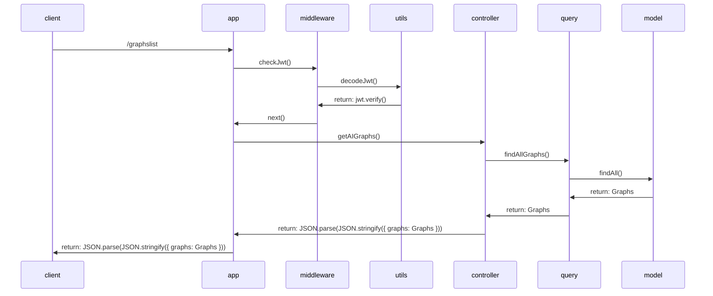
```mermaid
sequenceDiagram
    participant client
    participant app
    participant middleware
    participant utils
    participant controller
    participant query
    participant model

    client->>app: /graphslist
    app->>middleware: checkJwt()
    middleware->>utils: decodeJwt()
    utils->>middleware: return: jwt.verify()
    middleware->>app: next()
    app->>controller: getAIGraphs()
    controller->>query: findAllGraphs()
    query->>model: findAll()
    model->>query: return: Graphs
    query->>controller: return: Graphs
    controller->>app: return: JSON.parse(JSON.stringify({ graphs: Graphs }))
    app->>client: return: JSON.parse(JSON.stringify({ graphs: Graphs }))
```
Se la richiesta viene effettuata correttamente viene restituito il seguente messaggio:
```json
{
    "message": {
        "graphs": [
            {
                "graph_id": 1,
                "user_id": 1,
                "name": "Graph 1",
                "description": "Description of Graph 1",
                "cost": 3,
                "createdat": "2024-02-23",
                "updatedat": "2024-02-23"
            },
            {
                "graph_id": 2,
                "user_id": 2,
                "name": "Graph 2",
                "description": "Description of Graph 2",
                "cost": 4.1,
                "createdat": "2024-02-23",
                "updatedat": "2024-02-23"
            },
            {
                "graph_id": 3,
                "user_id": 3,
                "name": "Graph 3",
                "description": "Description of Graph 3",
                "cost": 2.3,
                "createdat": "2024-02-23",
                "updatedat": "2024-02-23"
            },
            {
                "graph_id": 4,
                "user_id": 1,
                "name": "Graph 4",
                "description": "Description of Graph 4",
                "cost": 5.1,
                "createdat": "2024-02-23",
                "updatedat": "2024-02-23"
            },
            {
                "graph_id": 5,
                "user_id": 2,
                "name": "Graph 5",
                "description": "Description of Graph 5",
                "cost": 6.6,
                "createdat": "2024-02-23",
                "updatedat": "2024-02-23"
            },
            {
                "graph_id": 6,
                "user_id": 3,
                "name": "Graph 6",
                "description": "Description of Graph 6",
                "cost": 1.9,
                "createdat": "2024-02-23",
                "updatedat": "2024-02-23"
            },
            {
                "graph_id": 7,
                "user_id": 3,
                "name": "GrafoSimulation",
                "description": "Un grafo di test per la simulazione con un arco dal peso elevato.",
                "cost": 9.9,
                "createdat": "2024-02-23",
                "updatedat": "2024-02-23"
            }
        ]
    }
}
```
### GET: /graph/edges
Per poter ottenere una risposta, il corpo delle richieste dovrà seguire il seguente modello:
```json
́{
    "graphId": 1
}
```
Il meccanismo che si innesca all'atto della chiamata è descritto dal seguente diagramma:
```mermaid

```
Se la richiesta viene effettuata correttamente viene restituito il seguente messaggio:
```json
{
    "message": {
        "edges": [
            {
                "edge_id": 49,
                "graph_id": 7,
                "start_node": "A",
                "end_node": "B",
                "weight": 50
            },
            {
                "edge_id": 50,
                "graph_id": 7,
                "start_node": "A",
                "end_node": "C",
                "weight": 1
            },
            {
                "edge_id": 51,
                "graph_id": 7,
                "start_node": "C",
                "end_node": "D",
                "weight": 1
            },
            {
                "edge_id": 52,
                "graph_id": 7,
                "start_node": "D",
                "end_node": "B",
                "weight": 1
            }
        ]
    }
}
```
In caso di errore invece verrà restituito un messaggio che ha come chiave il nome del codice violato e un messaggio di errore a seconda della casistica. Inoltre, verrà settato lo stato a seconda dello status code:
```json
{
    "graphId": 80
}
```
Genererà:
```json
{
    status: 404 NOT FOUND
    "message": "Non è possibile trovare il grafo specificato."
}
```
### GET: /user/all
Per poter ottenere una risposta non è necessario inserire un body, basta aver fatto l'autenticazione tramite JWT.
Il meccanismo che si innesca all'atto della chiamata è descritto dal seguente diagramma:
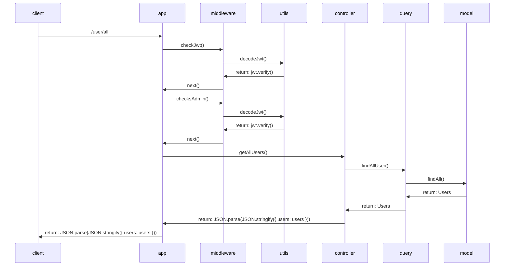
```mermaid
sequenceDiagram
    participant client
    participant app
    participant middleware
    participant utils
    participant controller
    participant query
    participant model

    client->>app: /user/all
    app->>middleware: checkJwt()
    middleware->>utils: decodeJwt()
    utils->>middleware: return: jwt.verify()
    middleware->>app: next()
    app->>middleware: checksAdmin()
    middleware->>utils: decodeJwt()
    utils->>middleware: return: jwt.verify()
    middleware->>app: next()
    app->>controller: getAllUsers()
    controller->>query: findAllUser()
    query->>model: findAll()
    model->>query: return: Users
    query->>controller: return: Users
    controller->>app: return: JSON.parse(JSON.stringify({ users: users }))
    app->>client: return: JSON.parse(JSON.stringify({ users: users }))

```
Se la richiesta viene effettuata correttamente viene restituito il seguente messaggio:
```json
{
    "message": {
        "users": [
            {
                "user_id": 1,
                "email": "daniele@op.it",
                "password": "Opti2024!",
                "tokens": 100,
                "isadmin": false
            },
            {
                "user_id": 2,
                "email": "alessandro@op.it",
                "password": "Opti2024!",
                "tokens": 100,
                "isadmin": false
            },
            {
                "user_id": 3,
                "email": "adriano@op.it",
                "password": "Opti2024!",
                "tokens": 100,
                "isadmin": true
            },
            {
                "user_id": 4,
                "email": "prova@op.it",
                "password": "opti2024!",
                "tokens": 100,
                "isadmin": false
            }
        ]
    }
}
```
### GET: /updates/graph/pending
Per poter ottenere una risposta, il corpo delle richieste dovrà seguire il seguente modello:
```json
́{
    "graphId": 1
}
```
Il meccanismo che si innesca all'atto della chiamata è descritto dal seguente diagramma:
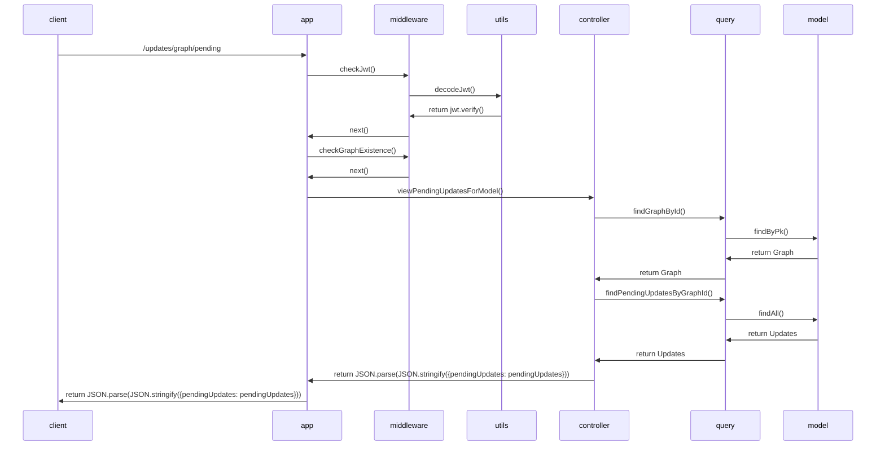
```mermaid
sequenceDiagram
    participant client
    participant app
    participant middleware
    participant utils
    participant controller
    participant query
    participant model

    client->>app: /updates/graph/pending
    app->>middleware: checkJwt()
    middleware->>utils: decodeJwt()
    utils->>middleware: return jwt.verify()
    middleware->>app: next()
    app->>middleware: checkGraphExistence()
    middleware->>app: next()
    app->>controller: viewPendingUpdatesForModel()
    controller->>query: findGraphById()
    query->>model: findByPk()
    model->>query: return Graph
    query->>controller: return Graph
    controller->>query: findPendingUpdatesByGraphId()
    query->>model: findAll()
    model->>query: return Updates
    query->>controller: return Updates
    controller->>app: return JSON.parse(JSON.stringify({pendingUpdates: pendingUpdates}))
    app->>client: return JSON.parse(JSON.stringify({pendingUpdates: pendingUpdates}))

```
Se la richiesta viene effettuata correttamente viene restituito il seguente messaggio:
```json
{
    "message": {
        "pendingUpdates": [
            {
                "update_id": 1,
                "graph_id": 1,
                "edge_id": 1,
                "requester_id": 2,
                "receiver_id": 1,
                "new_weight": 1.7,
                "approved": null,
                "createdat": "2024-02-23",
                "updatedat": "2024-02-23"
            },
            {
                "update_id": 2,
                "graph_id": 1,
                "edge_id": 4,
                "requester_id": 2,
                "receiver_id": 1,
                "new_weight": 2,
                "approved": null,
                "createdat": "2024-02-23",
                "updatedat": "2024-02-23"
            }
        ]
    }
}
```
In caso di errore invece verrà restituito un messaggio che ha come chiave il nome del codice violato e un messaggio di errore a seconda della casistica. Inoltre, verrà settato lo stato a seconda dello status code:
```json
{
    "graphId": 80
}
```
Genererà:
```json
{
    status: 404 NOT FOUND
    "message": "Non è possibile trovare il grafo specificato."
}
```
### GET: /updates/user/pending
Per poter ottenere una risposta non è necessario inserire un body, basta aver fatto l'autenticazione tramite JWT.
Il meccanismo che si innesca all'atto della chiamata è descritto dal seguente diagramma:
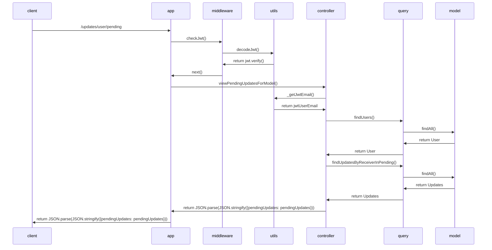
```mermaid
sequenceDiagram
    participant client
    participant app
    participant middleware
    participant utils
    participant controller
    participant query
    participant model

    client->>app: /updates/user/pending
    app->>middleware: checkJwt()
    middleware->>utils: decodeJwt()
    utils->>middleware: return jwt.verify()
    middleware->>app: next()
    app->>controller: viewPendingUpdatesForModel()
    controller->>utils: _getJwtEmail()
    utils->>controller: return jwtUserEmail
    controller->>query: findUsers()
    query->>model: findAll()
    model->>query: return User
    query->>controller: return User
    controller->>query: findUpdatesByReceiverInPending()
    query->>model: findAll()
    model->>query: return Updates
    query->>controller: return Updates
    controller->>app: return JSON.parse(JSON.stringify({pendingUpdates: pendingUpdates}))
    app->>client: return JSON.parse(JSON.stringify({pendingUpdates: pendingUpdates}))

```
Se la richiesta viene effettuata correttamente viene restituito il seguente messaggio:
```json
{
    "message": {
        "pendingUpdates": [
            {
                "update_id": 1,
                "graph_id": 1,
                "edge_id": 1,
                "requester_id": 2,
                "receiver_id": 1,
                "new_weight": 1.7,
                "approved": null,
                "createdat": "2024-02-23",
                "updatedat": "2024-02-23"
            },
            {
                "update_id": 2,
                "graph_id": 1,
                "edge_id": 4,
                "requester_id": 2,
                "receiver_id": 1,
                "new_weight": 2,
                "approved": null,
                "createdat": "2024-02-23",
                "updatedat": "2024-02-23"
            }
        ]
    }
}
```
### PUT: /recharge
Per poter ottenere una risposta, il corpo delle richieste dovrà seguire il seguente modello:
```json
́{
    "email":"alessandro@op.it",
    "tokens": 101
}

```
Il meccanismo che si innesca all'atto della chiamata è descritto dal seguente diagramma:
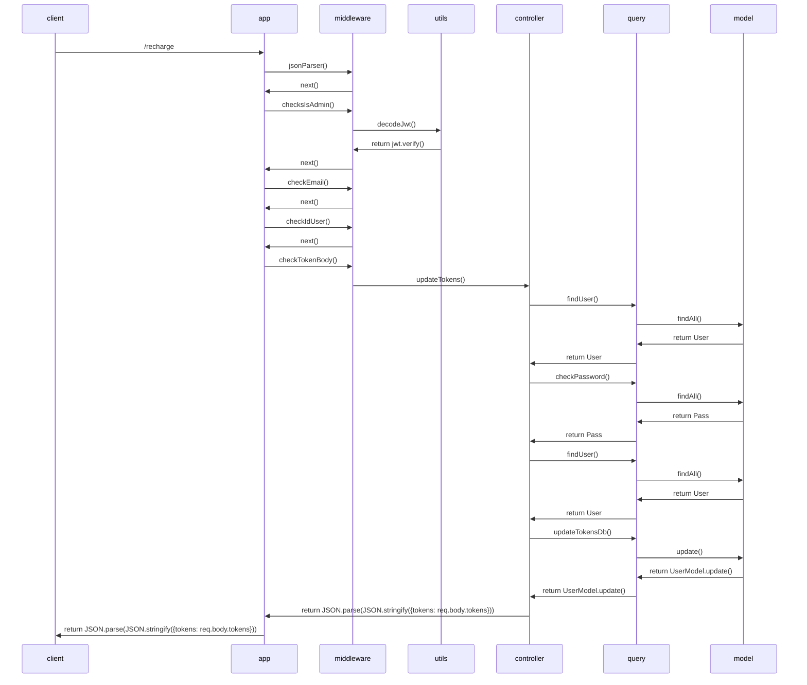
```mermaid
sequenceDiagram
    participant client
    participant app
    participant middleware
    participant utils
    participant controller
    participant query
    participant model

    client->>app: /recharge
    app->>middleware: jsonParser()
    middleware->>app: next()
    app->>middleware: checksIsAdmin()
    middleware->>utils: decodeJwt()
    utils->>middleware: return jwt.verify()
    middleware->>app: next()
    app->>middleware: checkEmail()
    middleware->>app: next()
    app->>middleware: checkIdUser()
    middleware->>app: next()
    app->>middleware: checkTokenBody()
    middleware->>controller: updateTokens()
    controller->>query: findUser()
    query->>model: findAll()
    model->>query: return User
    query->>controller: return User
    controller->>query: checkPassword()
    query->>model: findAll()
    model->>query: return Pass
    query->>controller: return Pass
    controller->>query: findUser()
    query->>model: findAll()
    model->>query: return User
    query->>controller: return User
    controller->>query: updateTokensDb()
    query->>model: update()
    model->>query: return UserModel.update()
    query->>controller: return UserModel.update()
    controller->>app: return JSON.parse(JSON.stringify({tokens: req.body.tokens}))
    app->>client: return JSON.parse(JSON.stringify({tokens: req.body.tokens}))

```
Se la richiesta viene effettuata correttamente viene restituito il seguente messaggio:
```json
{
    "message": {
        "tokens": 101
    }
}
```
In caso di errore invece verrà restituito un messaggio che ha come chiave il nome del codice violato e un messaggio di errore a seconda della casistica. Inoltre, verrà settato lo stato a seconda dello status code:
```json
{
    "email":"fabio@op.it",
    "tokens": 101
}
```
Genererà:
```json
{
    status: 404 NOT FOUND
    "message": "Non è possibile trovare l'utente specificato."
}
```
Oppure per il controllo dei valori dei tokens inseriti:
```json
{
    "email":"alessandro@op.it",
    "tokens": -101
}
```
Genererà:
```json
{
    status: 400 BAD REQUEST
    "message": "Non puoi inserire un numero di token negativo."
}
```
### PUT: /update/answer
Per poter ottenere una risposta, il corpo delle richieste dovrà seguire il seguente modello:
```json
{
      "request":[
                {
                    "updateId": 1,
                    "answer": false
                },
                {
                    "updateId":2,
                    "answer":true

                }
        ]
 }
```
Il meccanismo che si innesca all'atto della chiamata è descritto dal seguente diagramma:
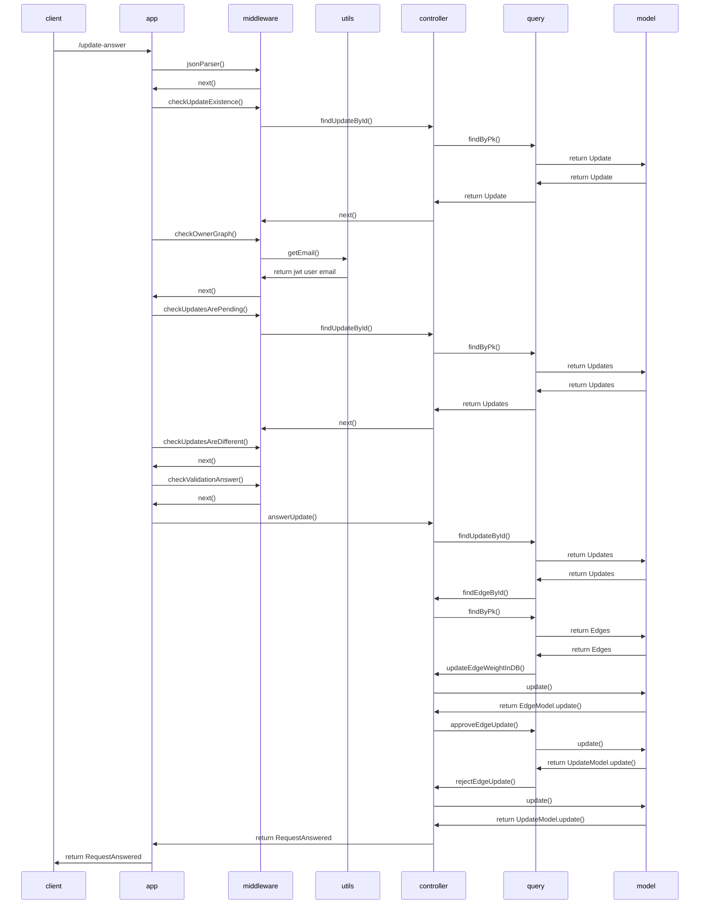
```mermaid
sequenceDiagram
    participant client
    participant app
    participant middleware
    participant utils
    participant controller
    participant query
    participant model

    client->>app: /update-answer
    app->>middleware: jsonParser()
    middleware->>app: next()
    app->>middleware: checkUpdateExistence()
    middleware->>controller: findUpdateById()
    controller->>query: findByPk()
    query->>model: return Update
    model->>query: return Update
    query->>controller: return Update
    controller->>middleware: next()
    app->>middleware: checkOwnerGraph()
    middleware->>utils: getEmail()
    utils->>middleware: return jwt user email
    middleware->>app: next()
    app->>middleware: checkUpdatesArePending()
    middleware->>controller: findUpdateById()
    controller->>query: findByPk()
    query->>model: return Updates
    model->>query: return Updates
    query->>controller: return Updates
    controller->>middleware: next()
    app->>middleware: checkUpdatesAreDifferent()
    middleware->>app: next()
    app->>middleware: checkValidationAnswer()
    middleware->>app: next()
    app->>controller: answerUpdate()
    controller->>query: findUpdateById()
    query->>model: return Updates
    model->>query: return Updates
    query->>controller: findEdgeById()
    controller->>query: findByPk()
    query->>model: return Edges
    model->>query: return Edges
    query->>controller: updateEdgeWeightInDB()
    controller->>model: update()
    model->>controller: return EdgeModel.update()
    controller->>query: approveEdgeUpdate()
    query->>model: update()
    model->>query: return UpdateModel.update()
    query->>controller: rejectEdgeUpdate()
    controller->>model: update()
    model->>controller: return UpdateModel.update()
    controller->>app: return RequestAnswered
    app->>client: return RequestAnswered

```
Se la richiesta viene effettuata correttamente viene restituito il seguente messaggio:
```json
{
    "message": "Richieste risposte con successo."
}
```
In caso di errore invece verrà restituito un messaggio che ha come chiave il nome del codice violato e un messaggio di errore a seconda della casistica. Inoltre, verrà settato lo stato a seconda dello status code:
```json
{
    status: 400 BAD REQUEST
    "message": "Non puoi modificare un update a cui già hai risposto."

}
```
### PUT: /update/edges
Per poter ottenere una risposta, il corpo delle richieste dovrà seguire il seguente modello:
```json
{
    "graphId":1,
    "updates":[
        {
            "edgeId":1,
            "newWeight":3
        }
    ]
}
```
Si distinguono due casi: il primo in cui i'utente che fa richiesta di modifica dell'arco **è il proprietario** del grafo e il secondo in cui l'utente che fa richiesta **non è il proprietario del grafo**, in questo caso viene inviata una richesta al proprietario che può **accettare/rifiutare** la richiesta di modifica.
#### CASO 1: L'utente è il proprietario
Il meccanismo che si innesca all'atto della chiamata è descritto dal seguente diagramma:
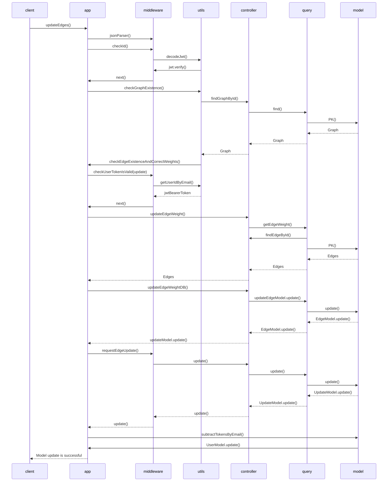
```mermaid
sequenceDiagram
    participant client
    participant app
    participant middleware
    participant utils
    participant controller
    participant query
    participant model

    client->>app: updateEdges()
    app->>middleware: jsonParser()
    app->>middleware: checkId()
    middleware->>utils: decodeJwt()
    utils->>middleware: jwt.verify()
    middleware->>app: next()
    app->>utils: checkGraphExistence()
    utils->>controller: findGraphById()
    controller->>query: find()
    query->>model: PK()
    model-->>query: Graph
    query-->>controller: Graph
    controller-->>utils: Graph
    utils->>app: checkEdgeExistenceAndCorrectWeights()
    app->>middleware: checkUserTokenIsValid(update)
    middleware->>utils: getUserIdByEmail()
    utils-->>middleware: jwtBearerToken
    middleware->>app: next()
    app->>controller: updateEdgeWeight()
    controller->>query: getEdgeWeight()
    query->>controller: findEdgeById()
    query->>model: PK()
    model-->>query: Edges
    query-->>controller: Edges
    controller-->>app: Edges
    app->>controller: updateEdgeWeightDB()
    controller->>query: updateEdgeModel.update()
    query->>model: update()
    model-->>query: EdgeModel.update()
    query-->>controller: EdgeModel.update()
    controller-->>app: updateModel.update()
    app->>middleware: requestEdgeUpdate()
    middleware->>controller: update()
    controller->>query: update()
    query->>model: update()
    model-->>query: UpdateModel.update()
    query-->>controller: UpdateModel.update()
    controller-->>middleware: update()
    middleware-->>app: update()
    app->>model: subtractTokensByEmail()
    model->>app: UserModel.update()
    app-->>client: Model update is successful

```
Se la richiesta viene effettuata correttamente viene restituito il seguente messaggio:
```json
{
    "message": "Modello aggiornato con successo."
}
```
#### CASO 2: L'utente non è il proprietario
Il meccanismo che si innesca all'atto della chiamata è descritto dal seguente diagramma:
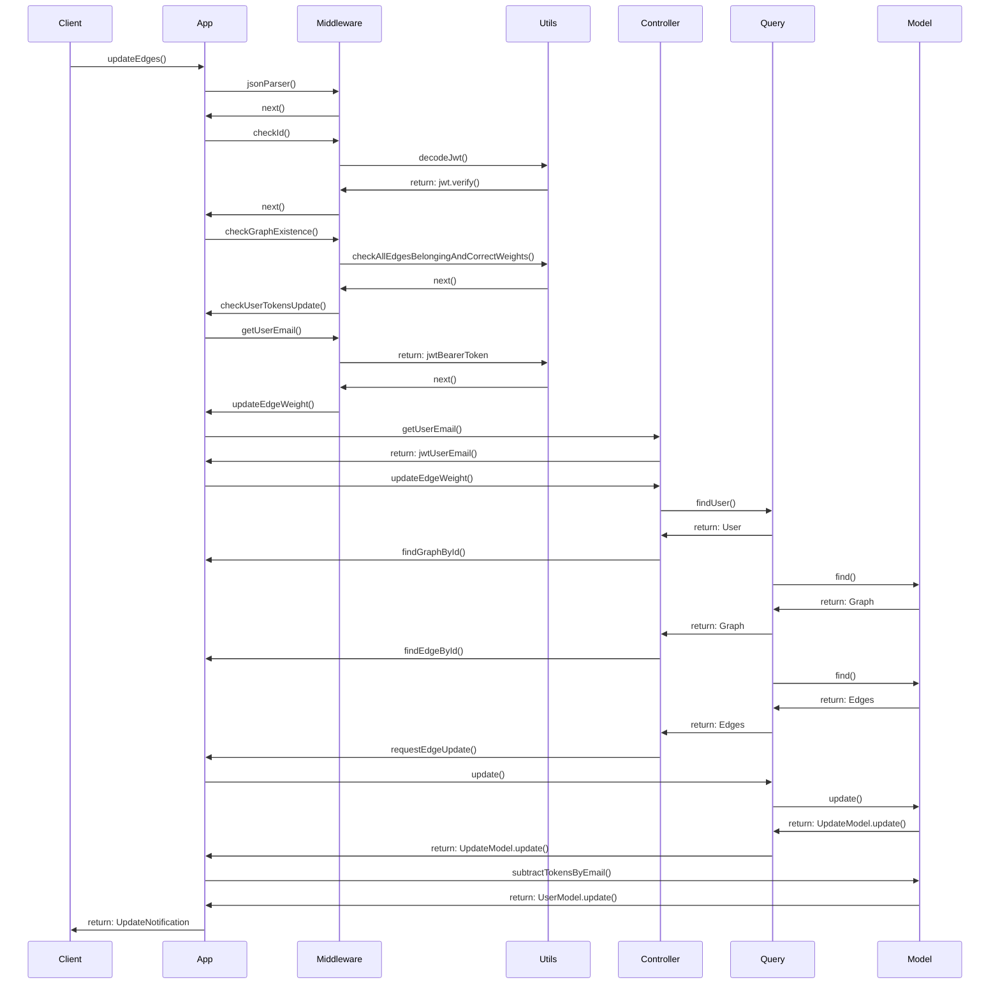
```mermaid
sequenceDiagram
    participant client as Client
    participant app as App
    participant middleware as Middleware
    participant utils as Utils
    participant controller as Controller
    participant query as Query
    participant model as Model

    client->>app: updateEdges()
    app->>middleware: jsonParser()
    middleware->>app: next()
    app->>middleware: checkId()
    middleware->>utils: decodeJwt()
    utils->>middleware: return: jwt.verify()
    middleware->>app: next()
    app->>middleware: checkGraphExistence()
    middleware->>utils: checkAllEdgesBelongingAndCorrectWeights()
    utils->>middleware: next()
    middleware->>app: checkUserTokensUpdate()
    app->>middleware: getUserEmail()
    middleware->>utils: return: jwtBearerToken
    utils->>middleware: next()
    middleware->>app: updateEdgeWeight()
    app->>controller: getUserEmail()
    controller->>app: return: jwtUserEmail()
    app->>controller: updateEdgeWeight()
    controller->>query: findUser()
    query->>controller: return: User
    controller->>app: findGraphById()
    query->>model: find()
    model->>query: return: Graph
    query->>controller: return: Graph
    controller->>app: findEdgeById()
    query->>model: find()
    model->>query: return: Edges
    query->>controller: return: Edges
    controller->>app: requestEdgeUpdate()
    app->>query: update()
    query->>model: update()
    model->>query: return: UpdateModel.update()
    query->>app: return: UpdateModel.update()
    app->>model: subtractTokensByEmail()
    model->>app: return: UserModel.update()
    app->>client: return: UpdateNotification
```
Se la richiesta viene effettuata correttamente viene restituito il seguente messaggio:
```json
{
    "message": "Richiesta di aggiornamento inviata con successo."
}
```
In caso di errore invece verrà restituito un messaggio che ha come chiave il nome del codice violato e un messaggio di errore a seconda della casistica. Inoltre, verrà settato lo stato a seconda dello status code:
```json
{
    "graphId":1,
    "updates":[
        {
            "edgeId":9,
            "newWeight":3
        }
    ]
}
```
```json
{
    status: 400 BAD REQUEST
    "message": "L'arco non appartiene al grafo."

}
```
### GET: /updates/history/graph
Per poter ottenere una risposta, il corpo delle richieste dovrà seguire il seguente modello:
```json
{
  "graphId": 1,
  "dateFilter": {
    // formato data YYYY-MM-DD
    "from": "2024-02-18", //inserire la data da cui partire (Superiore a...)
    "to": "2024-12-31" //inserire la data finale (Inferiore a...)
    //inserirle entrambe per avere un intervallo di tempo (Da...a...)
  },
  "status": ""
  // Valori possibili: "accepted", "rejected", o lasciare vuoto/null per non filtrare per stato
}
```
Il meccanismo che si innesca all'atto della chiamata è descritto dal seguente diagramma:
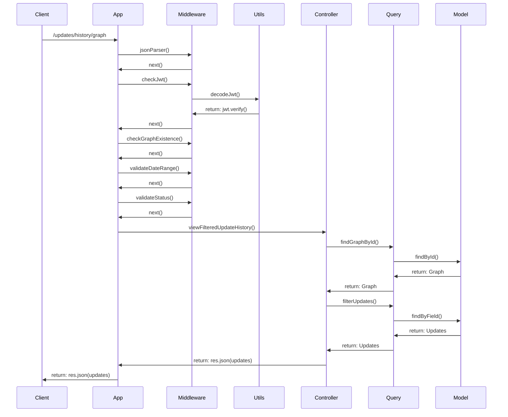
```mermaid
sequenceDiagram
    participant client as Client
    participant app as App
    participant middleware as Middleware
    participant utils as Utils
    participant controller as Controller
    participant query as Query
    participant model as Model

    client->>app: /updates/history/graph
    app->>middleware: jsonParser()
    middleware->>app: next()
    app->>middleware: checkJwt()
    middleware->>utils: decodeJwt()
    utils->>middleware: return: jwt.verify()
    middleware->>app: next()
    app->>middleware: checkGraphExistence()
    middleware->>app: next()
    app->>middleware: validateDateRange()
    middleware->>app: next()
    app->>middleware: validateStatus()
    middleware->>app: next()
    app->>controller: viewFilteredUpdateHistory()
    controller->>query: findGraphById()
    query->>model: findById()
    model->>query: return: Graph
    query->>controller: return: Graph
    controller->>query: filterUpdates()
    query->>model: findByField()
    model->>query: return: Updates
    query->>controller: return: Updates
    controller->>app: return: res.json(updates)
    app->>client: return: res.json(updates)

```
Se la richiesta viene effettuata correttamente viene restituito il seguente messaggio:
```json
[
    {
        "update_id": 1,
        "graph_id": 1,
        "edge_id": 1,
        "requester_id": 2,
        "receiver_id": 1,
        "new_weight": 1.7,
        "approved": false,
        "createdat": "2024-02-23",
        "updatedat": "2024-02-23"
    },
    {
        "update_id": 2,
        "graph_id": 1,
        "edge_id": 4,
        "requester_id": 2,
        "receiver_id": 1,
        "new_weight": 2,
        "approved": true,
        "createdat": "2024-02-23",
        "updatedat": "2024-02-23"
    },
    {
        "update_id": 7,
        "graph_id": 1,
        "edge_id": 1,
        "requester_id": 1,
        "receiver_id": 1,
        "new_weight": 3,
        "approved": true,
        "createdat": "2024-02-23",
        "updatedat": "2024-02-23"
    }
]
```
In caso di errore invece verrà restituito un messaggio che ha come chiave il nome del codice violato e un messaggio di errore a seconda della casistica. Inoltre, verrà settato lo stato a seconda dello status code:
```json
{
  "graphId": 1,
  "dateFilter": {
    // formato data YYYY-MM-DD
    "from": "2024-04-32", //inserire la data da cui partire (Superiore a...)
    "to": "2024-12-31" //inserire la data finale (Inferiore a...)
    //inserirle entrambe per avere un intervallo di tempo (Da...a...)
  },
  "status": ""
  // Valori possibili: "accepted", "rejected", o lasciare vuoto/null per non filtrare per stato
}
```
Genererà:
```json
{
    status: 400 BAD REQUEST
    "message": "Il formato della/delle data/e non è nel formato corretto."
}
```
### POST: /graph
Per poter ottenere una risposta, il corpo delle richieste dovrà seguire il seguente modello:
```json
{
  "name": "Grafo Test Simulazione 2",
  "description": "Un grafo di test per la simulazione con un arco dal peso elevato.",
  "nodes": ["A", "B", "C", "D", "E", "F", "G", "H", "I", "J", "K", "L", "M", "N", "O", "P"],
  "edges": [
    {"startNode": "A", "endNode": "B", "weight": 1},
    {"startNode": "B", "endNode": "C", "weight": 2},
    {"startNode": "C", "endNode": "D", "weight": 2},
    {"startNode": "D", "endNode": "E", "weight": 1},
    {"startNode": "E", "endNode": "F", "weight": 3},
    {"startNode": "F", "endNode": "G", "weight": 1},
    {"startNode": "G", "endNode": "H", "weight": 2},
    {"startNode": "H", "endNode": "A", "weight": 2},
    {"startNode": "I", "endNode": "J", "weight": 1},
    {"startNode": "J", "endNode": "K", "weight": 2},
    {"startNode": "K", "endNode": "L", "weight": 1},
    {"startNode": "L", "endNode": "M", "weight": 3},
    {"startNode": "M", "endNode": "N", "weight": 1},
    {"startNode": "N", "endNode": "O", "weight": 2},
    {"startNode": "O", "endNode": "P", "weight": 2},
    {"startNode": "P", "endNode": "I", "weight": 2},
    {"startNode": "A", "endNode": "I", "weight": 50}, // Arco con peso esageratamente grosso
    {"startNode": "E", "endNode": "M", "weight": 1},
    {"startNode": "B", "endNode": "J", "weight": 1}
  ]
}
```
Il meccanismo che si innesca all'atto della chiamata è descritto dal seguente diagramma:
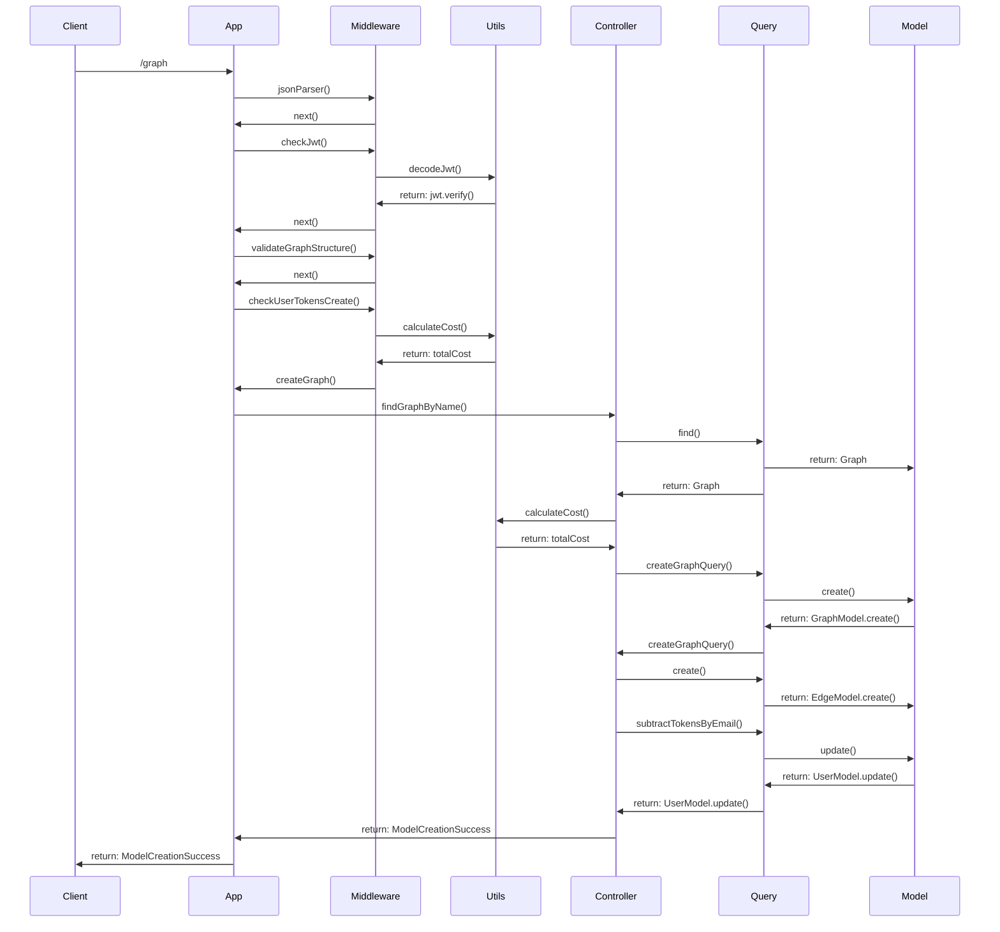
```mermaid
sequenceDiagram
    participant client as Client
    participant app as App
    participant middleware as Middleware
    participant utils as Utils
    participant controller as Controller
    participant query as Query
    participant model as Model

    client->>app: /graph
    app->>middleware: jsonParser()
    middleware->>app: next()
    app->>middleware: checkJwt()
    middleware->>utils: decodeJwt()
    utils->>middleware: return: jwt.verify()
    middleware->>app: next()
    app->>middleware: validateGraphStructure()
    middleware->>app: next()
    app->>middleware: checkUserTokensCreate()
    middleware->>utils: calculateCost()
    utils->>middleware: return: totalCost
    middleware->>app: createGraph()
    app->>controller: findGraphByName()
    controller->>query: find()
    query->>model: return: Graph
    query->>controller: return: Graph
    controller->>utils: calculateCost()
    utils->>controller: return: totalCost
    controller->>query: createGraphQuery()
    query->>model: create()
    model->>query: return: GraphModel.create()
    query->>controller: createGraphQuery()
    controller->>query: create()
    query->>model: return: EdgeModel.create()
    controller->>query: subtractTokensByEmail()
    query->>model: update()
    model->>query: return: UserModel.update()
    query->>controller: return: UserModel.update()
    controller->>app: return: ModelCreationSuccess
    app->>client: return: ModelCreationSuccess

```
Se la richiesta viene effettuata correttamente viene restituito il seguente messaggio:
```json
{
    "message": "Modello creato con successo."
}
```
In caso di errore invece verrà restituito un messaggio che ha come chiave il nome del codice violato e un messaggio di errore a seconda della casistica. Inoltre, verrà settato lo stato a seconda dello status code:
```json
{
  "name": "Grafo Test Simulazione 2",
  "description": "Un grafo di test per la simulazione con un arco dal peso elevato.",
  "nodes": ["A", "B", "C", "D"],
  "edges": [
    {"startNode": "A", "endNode": "B", "weight": 1},
    {"startNode": "B", "endNode": "C", "weight": 2},
    {"startNode": "C", "endNode": "D", "weight": 2}
  ]
}
```
Genererà:
```json
{
    status: 400 BAD REQUEST
    "message": "Il nome del grafo 'Grafo Test Simulazione 2' è già in uso."
}
```
### GET: /graph/calculatecost
Per poter ottenere una risposta, il corpo delle richieste dovrà seguire il seguente modello:
```json
{
  "graphId":1,
  "startNode": "A",
  "endNode": "D"
}
```
Il meccanismo che si innesca all'atto della chiamata è descritto dal seguente diagramma:
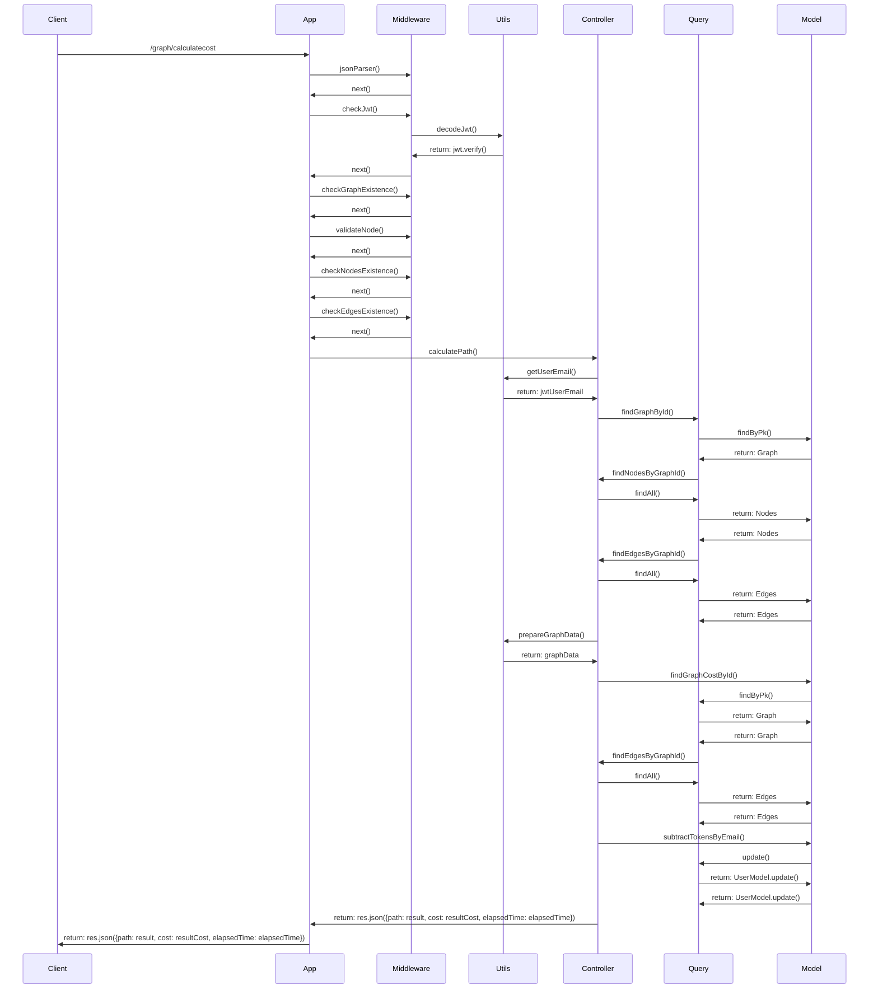
```mermaid
sequenceDiagram
    participant client as Client
    participant app as App
    participant middleware as Middleware
    participant utils as Utils
    participant controller as Controller
    participant query as Query
    participant model as Model

    client->>app: /graph/calculatecost
    app->>middleware: jsonParser()
    middleware->>app: next()
    app->>middleware: checkJwt()
    middleware->>utils: decodeJwt()
    utils->>middleware: return: jwt.verify()
    middleware->>app: next()
    app->>middleware: checkGraphExistence()
    middleware->>app: next()
    app->>middleware: validateNode()
    middleware->>app: next()
    app->>middleware: checkNodesExistence()
    middleware->>app: next()
    app->>middleware: checkEdgesExistence()
    middleware->>app: next()
    app->>controller: calculatePath()
    controller->>utils: getUserEmail()
    utils->>controller: return: jwtUserEmail
    controller->>query: findGraphById()
    query->>model: findByPk()
    model->>query: return: Graph
    query->>controller: findNodesByGraphId()
    controller->>query: findAll()
    query->>model: return: Nodes
    model->>query: return: Nodes
    query->>controller: findEdgesByGraphId()
    controller->>query: findAll()
    query->>model: return: Edges
    model->>query: return: Edges
    controller->>utils: prepareGraphData()
    utils->>controller: return: graphData
    controller->>model: findGraphCostById()
    model->>query: findByPk()
    query->>model: return: Graph
    model->>query: return: Graph
    query->>controller: findEdgesByGraphId()
    controller->>query: findAll()
    query->>model: return: Edges
    model->>query: return: Edges
    controller->>model: subtractTokensByEmail()
    model->>query: update()
    query->>model: return: UserModel.update()
    model->>query: return: UserModel.update()
    controller->>app: return: res.json({path: result, cost: resultCost, elapsedTime: elapsedTime})
    app->>client: return: res.json({path: result, cost: resultCost, elapsedTime: elapsedTime})
```
Se la richiesta viene effettuata correttamente viene restituito il seguente messaggio:
```json
{
    "path": [
        "A",
        "B",
        "C",
        "D"
    ],
    "cost": 5.6000000000000005,
    "elapsedTime": 3,
    "message": "Path calculated successfully."
}
```
In caso di errore invece verrà restituito un messaggio che ha come chiave il nome del codice violato e un messaggio di errore a seconda della casistica. Inoltre, verrà settato lo stato a seconda dello status code:
```json
{
  "graphId":1,
  "startNode": "A",
  "endNode": "O"
}
```
Genererà:
```json
{
    status: 400 BAD REQUEST
    "message": "Il nodo di partenza o di arrivo non esiste/esistono."

}
```
### GET: /updates/format
Per poter ottenere una risposta, il corpo delle richieste dovrà seguire il seguente modello:
```json
{
  "graphId": 1,
  "dateFilter": {
    "from": "2024-01-01",
    "to": "2024-12-31"
  },
  "status": "accepted", // accepted, rejected o vuoto per averle entrambe
  "format": "xml" // fromati disponibili: pdf, xml, csv, json
}
```
Il meccanismo che si innesca all'atto della chiamata è descritto dal seguente diagramma:
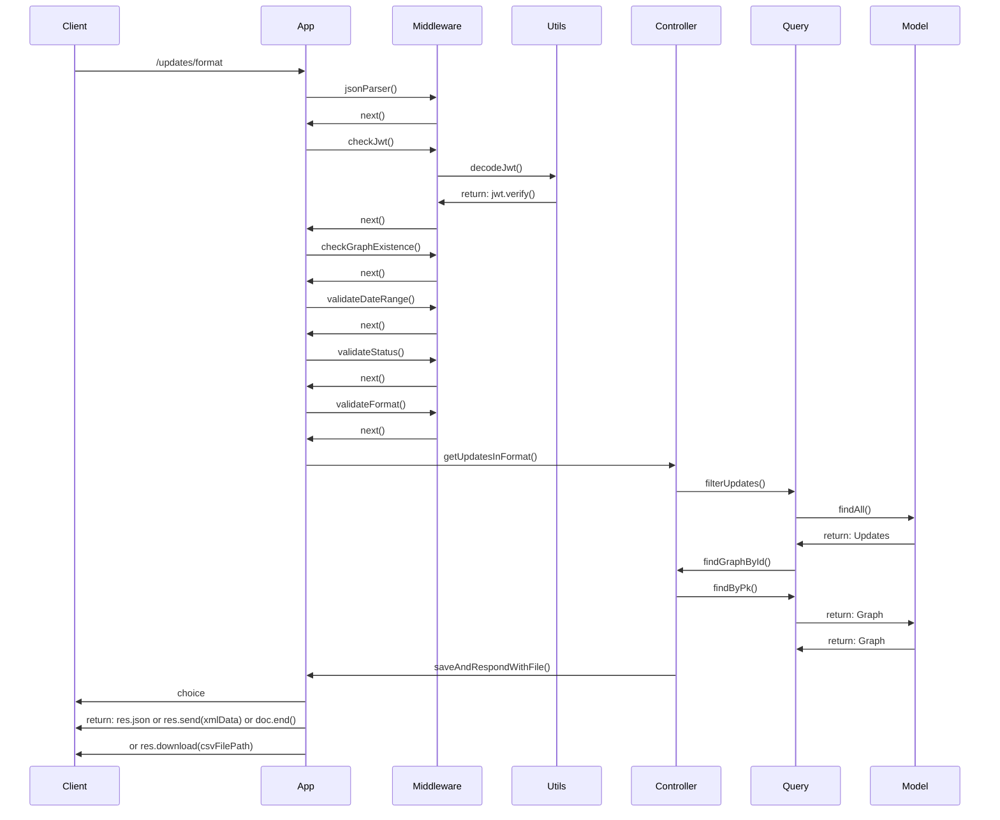
```mermaid
sequenceDiagram
    participant client as Client
    participant app as App
    participant middleware as Middleware
    participant utils as Utils
    participant controller as Controller
    participant query as Query
    participant model as Model

    client->>app: /updates/format
    app->>middleware: jsonParser()
    middleware->>app: next()
    app->>middleware: checkJwt()
    middleware->>utils: decodeJwt()
    utils->>middleware: return: jwt.verify()
    middleware->>app: next()
    app->>middleware: checkGraphExistence()
    middleware->>app: next()
    app->>middleware: validateDateRange()
    middleware->>app: next()
    app->>middleware: validateStatus()
    middleware->>app: next()
    app->>middleware: validateFormat()
    middleware->>app: next()
    app->>controller: getUpdatesInFormat()
    controller->>query: filterUpdates()
    query->>model: findAll()
    model->>query: return: Updates
    query->>controller: findGraphById()
    controller->>query: findByPk()
    query->>model: return: Graph
    model->>query: return: Graph
    controller->>app: saveAndRespondWithFile()
    app->>client: choice
    app->>client: return: res.json or res.send(xmlData) or doc.end()
    app->>client: or res.download(csvFilePath)

```
Se la richiesta viene effettuata correttamente viene restituito il seguente messaggio:
```xml
<graphInfo>
    <dataValues>
        <graph_id>1</graph_id>
        <user_id>1</user_id>
        <name>Graph 1</name>
        <description>Description of Graph 1</description>
        <cost>3</cost>
        <createdat>2024-02-23</createdat>
        <updatedat>2024-02-23</updatedat>
    </dataValues>
    <_previousDataValues>
        <graph_id>1</graph_id>
        <user_id>1</user_id>
        <name>Graph 1</name>
        <description>Description of Graph 1</description>
        <cost>3</cost>
        <createdat>2024-02-23</createdat>
        <updatedat>2024-02-23</updatedat>
    </_previousDataValues>
    <uniqno>1</uniqno>
    <_changed/>
    <_options>
        <isNewRecord>false</isNewRecord>
        <_schema/>
        <_schemaDelimiter/>
        <raw>true</raw>
        <attributes>graph_id</attributes>
        <attributes>user_id</attributes>
        <attributes>name</attributes>
        <attributes>description</attributes>
        <attributes>cost</attributes>
        <attributes>createdat</attributes>
        <attributes>updatedat</attributes>
    </_options>
    <isNewRecord>false</isNewRecord>
</graphInfo>
<updates>
    <dataValues>
        <update_id>2</update_id>
        <graph_id>1</graph_id>
        <edge_id>4</edge_id>
        <requester_id>2</requester_id>
        <receiver_id>1</receiver_id>
        <new_weight>2</new_weight>
        <approved>true</approved>
        <createdat>2024-02-23</createdat>
        <updatedat>2024-02-23</updatedat>
    </dataValues>
    <_previousDataValues>
        <update_id>2</update_id>
        <graph_id>1</graph_id>
        <edge_id>4</edge_id>
        <requester_id>2</requester_id>
        <receiver_id>1</receiver_id>
        <new_weight>2</new_weight>
        <approved>true</approved>
        <createdat>2024-02-23</createdat>
        <updatedat>2024-02-23</updatedat>
    </_previousDataValues>
    <uniqno>1</uniqno>
    <_changed/>
    <_options>
        <isNewRecord>false</isNewRecord>
        <_schema/>
        <_schemaDelimiter/>
        <raw>true</raw>
        <attributes>update_id</attributes>
        <attributes>graph_id</attributes>
        <attributes>edge_id</attributes>
        <attributes>requester_id</attributes>
        <attributes>receiver_id</attributes>
        <attributes>new_weight</attributes>
        <attributes>approved</attributes>
        <attributes>createdat</attributes>
        <attributes>updatedat</attributes>
    </_options>
    <isNewRecord>false</isNewRecord>
</updates>
<updates>
    <dataValues>
        <update_id>7</update_id>
        <graph_id>1</graph_id>
        <edge_id>1</edge_id>
        <requester_id>1</requester_id>
        <receiver_id>1</receiver_id>
        <new_weight>3</new_weight>
        <approved>true</approved>
        <createdat>2024-02-23</createdat>
        <updatedat>2024-02-23</updatedat>
    </dataValues>
    <_previousDataValues>
        <update_id>7</update_id>
        <graph_id>1</graph_id>
        <edge_id>1</edge_id>
        <requester_id>1</requester_id>
        <receiver_id>1</receiver_id>
        <new_weight>3</new_weight>
        <approved>true</approved>
        <createdat>2024-02-23</createdat>
        <updatedat>2024-02-23</updatedat>
    </_previousDataValues>
    <uniqno>1</uniqno>
    <_changed/>
    <_options>
        <isNewRecord>false</isNewRecord>
        <_schema/>
        <_schemaDelimiter/>
        <raw>true</raw>
        <attributes>update_id</attributes>
        <attributes>graph_id</attributes>
        <attributes>edge_id</attributes>
        <attributes>requester_id</attributes>
        <attributes>receiver_id</attributes>
        <attributes>new_weight</attributes>
        <attributes>approved</attributes>
        <attributes>createdat</attributes>
        <attributes>updatedat</attributes>
    </_options>
    <isNewRecord>false</isNewRecord>
</updates>
```
In caso di errore invece verrà restituito un messaggio che ha come chiave il nome del codice violato e un messaggio di errore a seconda della casistica. Inoltre, verrà settato lo stato a seconda dello status code:
```json
{
  "graphId": 1,
  "dateFilter": {
    "from": "2024-01-01",
    "to": "2024-12-31"
  },
  "status": "", // accepted, rejected o vuoto per averle entrambe
  "format": "docx" // fromati disponibili: pdf, xml, csv, json
}
```
Genererà:
```json
{
    status: 400 BAD REQUEST
    "message": " Il formato inserito non è supportato, perfavore inserisci: pdf, xml, csv o json."

}
```
### GET: /simulate
Per poter ottenere una risposta, il corpo delle richieste dovrà seguire il seguente modello:
```json
{
  "graphId": 1,
  "edgeId": 2,
  "startNode": "A",
  "endNode": "B",
  "startWeight": 0.5,
  "endWeight": 10,
  "step": 1
}
```
Il meccanismo che si innesca all'atto della chiamata è descritto dal seguente diagramma:
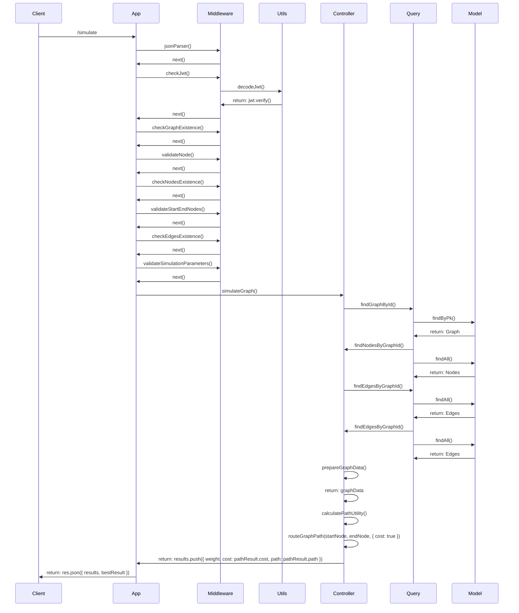
```mermaid
sequenceDiagram
    participant client as Client
    participant app as App
    participant middleware as Middleware
    participant utils as Utils
    participant controller as Controller
    participant query as Query
    participant model as Model

    client->>app: /simulate
    app->>middleware: jsonParser()
    middleware->>app: next()
    app->>middleware: checkJwt()
    middleware->>utils: decodeJwt()
    utils->>middleware: return: jwt.verify()
    middleware->>app: next()
    app->>middleware: checkGraphExistence()
    middleware->>app: next()
    app->>middleware: validateNode()
    middleware->>app: next()
    app->>middleware: checkNodesExistence()
    middleware->>app: next()
    app->>middleware: validateStartEndNodes()
    middleware->>app: next()
    app->>middleware: checkEdgesExistence()
    middleware->>app: next()
    app->>middleware: validateSimulationParameters()
    middleware->>app: next()
    app->>controller: simulateGraph()
    controller->>query: findGraphById()
    query->>model: findByPk()
    model->>query: return: Graph
    query->>controller: findNodesByGraphId()
    query->>model: findAll()
    model->>query: return: Nodes
    controller->>query: findEdgesByGraphId()
    query->>model: findAll()
    model->>query: return: Edges
    query->>controller: findEdgesByGraphId()
    query->>model: findAll()
    model->>query: return: Edges
    controller->>controller: prepareGraphData()
    controller->>controller: return: graphData
    controller->>controller: calculatePathUtility()
    controller->>controller: routeGraphPath(startNode, endNode, { cost: true })
    controller->>app: return: results.push({ weight, cost: pathResult.cost, path: pathResult.path })
    app->>client: return: res.json({ results, bestResult })

```
In caso di errore invece verrà restituito un messaggio che ha come chiave il nome del codice violato e un messaggio di errore a seconda della casistica. Inoltre, verrà settato lo stato a seconda dello status code:
```json
{
  "graphId": 2,
  "edgeId": 3,
  "startNode": "A",
  "endNode": "B",
  "startWeight": 9,
  "endWeight": 10,
  "step": 1
}
```
Genererà:
```json
{
    status: 400 BAD REQUEST
    "message": "L'arco non appartiene al grafo."

}
```


## Testing

Per testare il progetto, è essenziale seguire una serie di passaggi che garantiscano la configurazione corretta dell'ambiente di sviluppo e l'esecuzione efficace dei test. Ecco una guida dettagliata:

1. **Scaricare il Progetto**: Utilizzare l'URL del repository Git per clonarlo o scaricare direttamente il file ZIP.
2. **Importare il Pacchetto Postman**: Nella cartella Postman del progetto, troverai un pacchetto di chiamate da importare in Postman per testare le API.
3. **Configurare il File `.env`**: Compila il file `.env` con i dati necessari seguendo come esempio il file `.env` fornito.
4. **Installare Docker**: Scaricare e installare Docker dal sito ufficiale per gestire i container necessari al progetto.
5. **Avviare i Servizi con Docker**: Assicurati che Docker sia in esecuzione e di trovarti all'interno della cartella *backend*. Successivamente avvia i servizi necessari con il comando:
   ```bash
   docker-compose up --build
   ```
6. **Testare con Postman**: Utilizza Postman per inviare chiamate al server e analizzare le risposte ottenute.

Ricorda di consultare la documentazione del progetto per dettagli aggiuntivi e per qualsiasi chiarimento necessario. Questa procedura ti guiderà attraverso la configurazione, l'esecuzione dei test e l'interpretazione dei risultati, assicurando che il progetto funzioni come previsto.

## Autori

- ***[Alessandro Rongoni](https://github.com/AlessandroRongoni)***
- ***[Daniele Sergiacomi](https://github.com/sergytube)***

