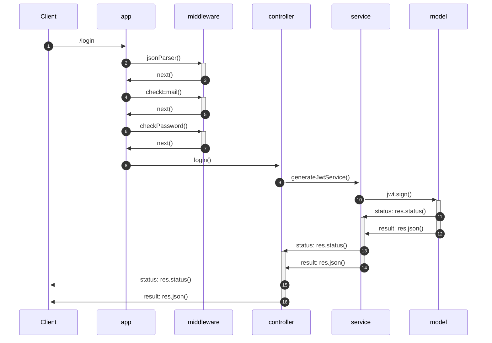
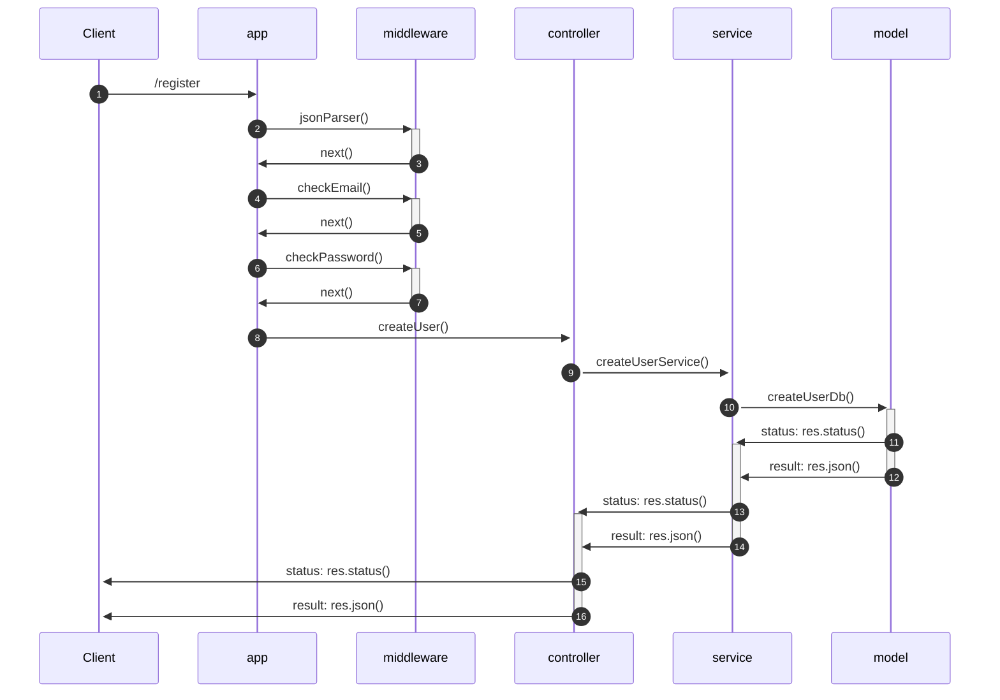
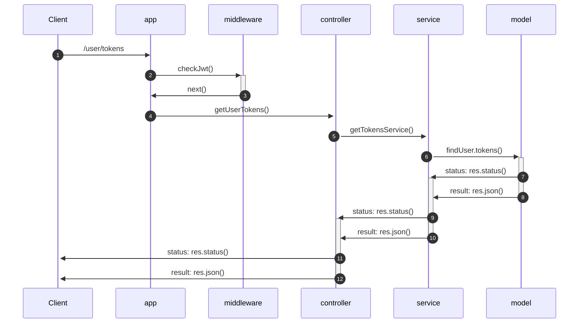
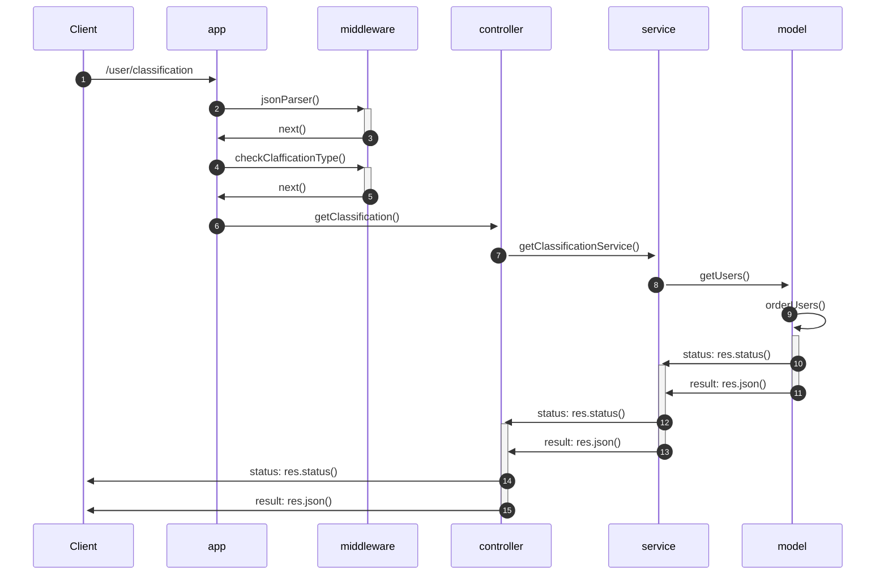
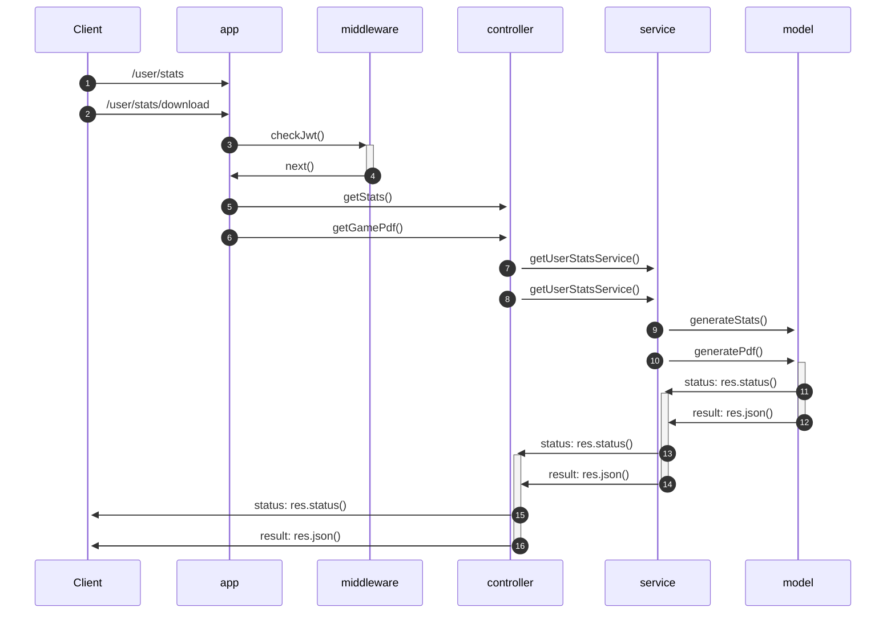
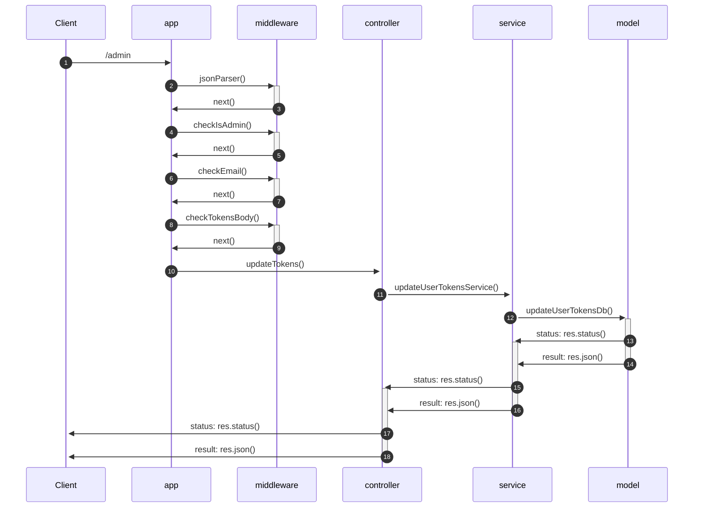
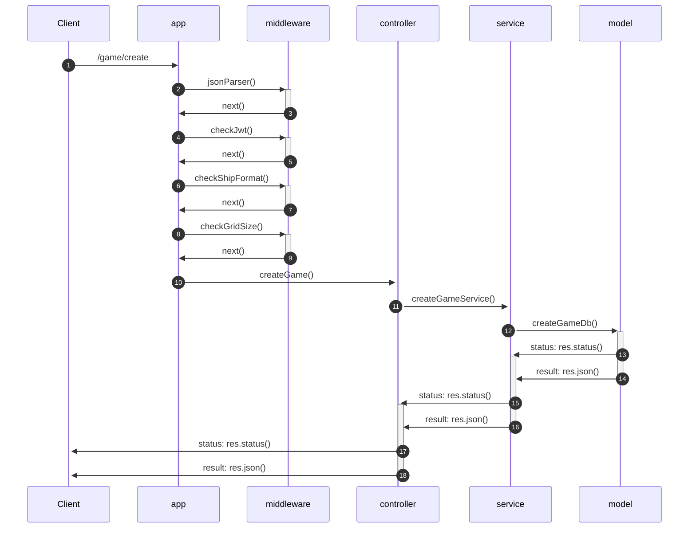
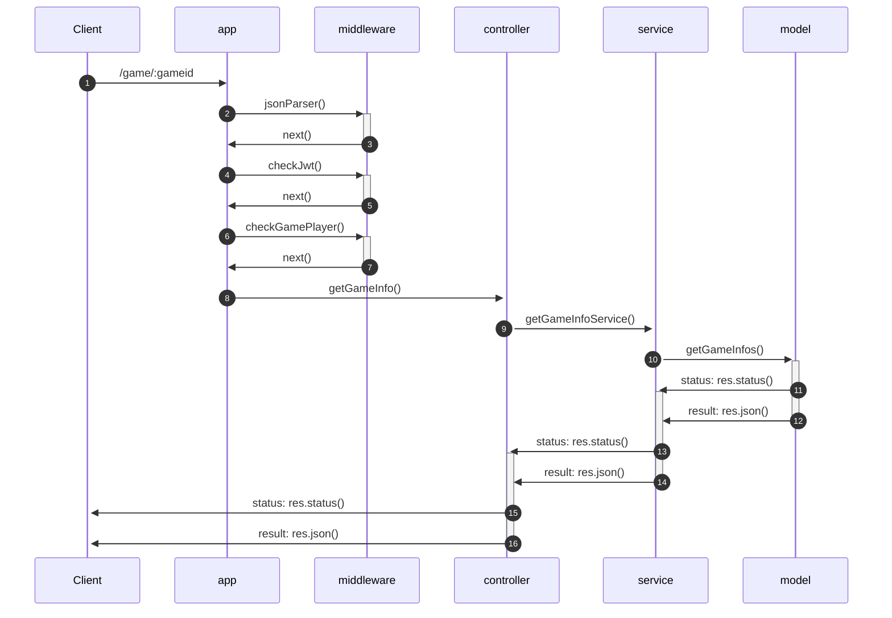
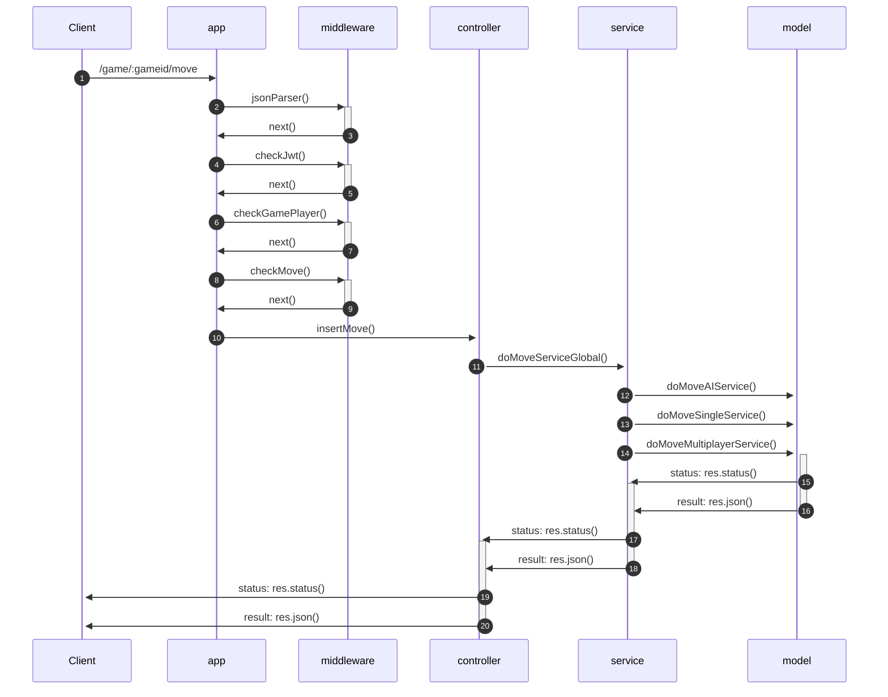
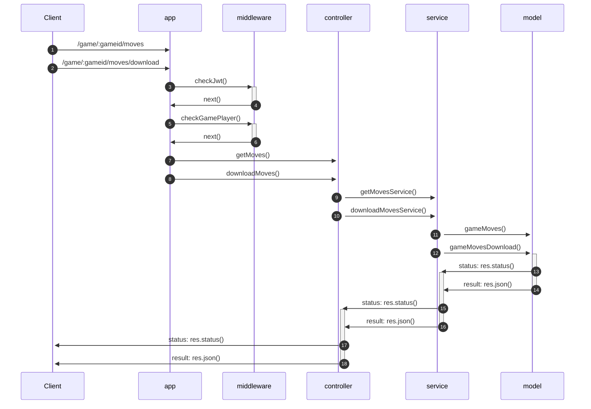

<div>
<p  align="center">

</p>

[](https://www.postgresql.org/)
[](https://www.npmjs.com/)
[](https://nodejs.org/en)
[](https://expressjs.com/it/)
[](https://jwt.io/)
[](https://code.visualstudio.com/)
[](https://www.typescriptlang.org/)
[](https://sequelize.org/)
[](https://www.docker.com/)
[](https://www.postman.com/)

  
</p>
<p  align="center">
 Indice
</p>

</p>
<p  align="center">
<a  href="#obiettivi-del-progetto">Obiettivi del progetto</a>&nbsp•
<a  href="#progettazione">Progettazione</a>&nbsp•
<a  href="#funzionamento">Funzionamento</a>&nbsp•
<a  href="#testing">Testing</a>&nbsp•
<a  href="#autori">Autori</a>
</p>
<br>
<br>
</div>

  

  

## Obiettivi del progetto

  
  
**Descrizione del progetto:**

*Le specifiche del progetto sono state fornite direttamente dal docente [*Adriano Mancini*](https://github.com/manciniadriano):*

*Si realizzi un sistema che consenta di gestire il gioco della battaglia navale. In particolare, il sistema deve prevedere la possibilità di far interagire due o tre utenti (autenticati mediante JWT) o un utente contro l’elaboratore. Ci possono essere più partite attive in un dato momento. Un utente può allo stesso tempo partecipare ad una ed una sola partita. Si chiede di sviluppare anche la possibilità di giocare contro l’elaboratore (di seguito IA). Nel caso di IA la logica può essere semplice (mosse randomiche all’interno della griglia) o tenere in considerazione lo storico delle mosse (es. cercare nei vicini); l’implementazione è carico del gruppo. Nel caso di gioco a tre player la turnazione deve essere A->B, C->A, B->C , C->B, A->C, B->A (il gioco potrebbe non essere equo)*

<p align="center">

</p>

*Dare la possibilità di creare una nuova partita specificando (codifica a scelta dello studente):*
- *Tipologia: utente contro utente o utente contro IA o utente contro 2 utenti*
- *Dimensione della griglia*
- *Numero e tipologie delle imbarcazioni*
- *L’allocazione delle imbarcazioni è randomica (fatta all’atto della creazione).*
- *email dell’avversario o email degli avversari che sarà/saranno usata/e poi per autenticare le richieste mediante token JWT*

*Per ogni partita viene addebitato un numero di token in accordo con quanto segue:*
- *0.450 all’atto della creazione*
- *0.015 per ogni mossa da parte degli utenti (anche IA)*

*Il modello può essere creato se c’è credito sufficiente ad esaudire la richiesta (se il credito durante la partita scende sotto lo zero si può continuare comunque). *

- *Creare una rotta per effettuare una mossa in una data partita verificando se questa è ammissibile o meno.*
- *Creare una rotta per valutare lo stato di una data partita (di chi è il turno, se è terminata, vincitore,…)*
- *Creare una rotta per restituire lo storico delle mosse di una data partita con la possibilità di esportare in JSON (codifica a scelta del gruppo).*
- *Creare una rotta per restituire le statistiche di un utente ed in particolare: numero partite vinte, numero di partite perse, numero totale di partite giocate, numero min, massimo, media e deviazione standard delle mosse; dare la possibilità di filtrare per date (intervallo); dare la possibilità di restituire sotto forma di JSON o PDF (libreria a scelta del gruppo). *
- *Restituire la classifica dei giocatori dando la possibilità di scegliere l’ordinamento ascendente / discendente. Questa rotta è pubblica e non deve essere autenticata.*

*Le richieste devono essere validate (es. utente che scelga un evento che non esistente, payload non corretti dal punto di vista semantico, es. griglia con dimensione nulla o negativa.).*

*Ogni utente autenticato (ovvero con JWT) ha un numero di token (valore iniziale impostato nel seed del database).*

*Nel caso di token terminati ogni richiesta da parte dello stesso utente deve restituire 401 Unauthorized.*

*Prevedere una rotta per l’utente con ruolo admin che consenta di effettuare la ricarica per un utente fornendo la mail ed il nuovo “credito” (sempre mediante JWT). I token JWT devono contenere i dati essenziali.*

*Il numero residuo di token deve essere memorizzato nel db sopra citato.*

*Si deve prevedere degli script di seed per inizializzare il sistema. *

*Si chiede di utilizzare le funzionalità di middleware.* 

*Si chiede di gestire eventuali errori mediante gli strati middleware sollevando le opportune eccezioni.*

*Si chiede di commentare opportunamente il codice.*

<p align="center">
<a href="#obiettivi-del-progetto">

</a>
</p>

## Progettazione

### Diagrammi UML

Prima di poter implementare il progetto è stato necessario effettuare un'analisi progettuale riguardante ciò che doveva essere realizzato. 

In figura mostriamo i casi d'uso analizzati:

<p align="center">

</p>

### Rotte

Dall'analisi effettuata, abbiamo create le seguenti rotte che verranno analizzate in seguito nello specifico:

<table align="center">
    <thead>
        <tr>
            <th>Tipo</th>
            <th>Rotta</th>
            <th>Parametri</th>
        </tr>
    </thead>
    <tbody>
        <tr>
        <td> POST</td>
         <td> /login</td>
         <td> email, password </td>
         </tr>
         <tr>
          <td> POST</td>
         <td> /register</td>
         <td> email, password </td>
         </tr>
         <tr>
         <td> GET</td>
         <td> /user/token</td>
         <td>  </td>
         </tr>
          <tr>
         <td> POST</td>
         <td> /user/classification</td>
         <td> type</td>
        </tr>
          <tr>
         <td> POST</td>
         <td> /user/stats</td>
         <td> startDate, endDate</td>
        </tr>
        <tr>
         <td> GET</td>
         <td> /user/stats/download</td>
         <td> </td>
        </tr>
         <tr>
         <td> POST</td>
         <td> /admin</td>
         <td> email, tokens </td>
        </tr>
        <tr>
         <td> POST</td>
         <td> /game/create</td>
         <td> name, player1, player2, grid_size, ships</td>
        </tr>
         <tr>
         <td> GET</td>
         <td> /game/:gameid</td>
         <td> gameid</td>
        </tr>
         <tr>
         <td> POST</td>
         <td> /game/:gameid/move</td>
         <td> gameid, move</td>
        </tr>
        <tr>
         <td> GET</td>
         <td> /game/:gameid/moves</td>
         <td> gameid</td>
        </tr>
        <tr>
         <td> GET</td>
         <td> /game/:gameid/moves/download</td>
         <td> gameid</td>
        </tr>
        <tr>
    </tbody>
 </table>

Abbiamo aggiunto alcune rotte che non sono propriamente parte del progetto ma che possono facilitare il testing:

<table align="center">
    <thead>
        <tr>
            <th>Tipo</th>
            <th>Rotta</th>
            <th>Parametri</th>
        </tr>
    </thead>
    <tbody>
	 <tr>
         <td> GET</td>
         <td> /</td>
         <td> </td>
        </tr>
        <tr>
         <td> GET</td>
         <td> /user/all</td>
         <td> </td>
        </tr>
        <tr>
         <td> GET</td>
         <td> /games</td>
         <td> </td>
        </tr>
        <tr>
    </tbody>
 </table>
 
Queste rotte ci hanno permesso di verificare che l'applicazione Node venga avviata correttamente, di ottenere tutte le informazioni legate ad un utente e di tutte le informazioni relative ai game presenti nel Database.

### Pattern utilizzati

Come da specifiche, per implementare il progetto abbiamo fatto riferimento ad alcuni pattern analizzati a lezione, andremo ora ad analizzarli nello specifico.

#### M(V)CS

Il progetto è stato strutturato seguendo il pattern Model (View) Controller modificato con l'aggiunta di un layer ulteriore quale il Service. Nel progetto attuale la View risulta mancante ma è stata considerata come potenziale sviluppo futuro. Il service funge da interlocutore tra il controller ed il database, in questo modo le responsabilità sono divise ed il controller si occupa principalmente di richiamare le funzioni sviluppate con il Service.

<p align="center">

</p>

#### Singleton

Il pattern creazionale Singleton è stato utilizzato per creare una singola istanza quando effettuiamo la connessione al database. La classe, oltre al costruttore, ha un unico metodo che ci consente di ottenere la connessione al database PostgreSQL, la quale verrà richiamata dai model User e Game.

```typescript
export class DbConnector {
	private  static instance: DbConnector;
	private sequelizer: any;
	private  constructor() {
		this.sequelizer = new Sequelize('bitbattledb', 'postgres', 'postgres', {
		host: 'db',
		dialect: 'postgres',
	});
}

public  static getConnection(): any {
	if (!DbConnector.instance) {
		this.instance = new DbConnector();
		}
		return DbConnector.instance.sequelizer;
	}
}
 ```


<p align="center">

</p>

#### Abstract
Il pattern creazionale Abstract è stato utilizzato per la generazione delle res.json e delle res.status da inviare all'utente a seconda dell'esito di una chiamata. La classe astratta possiede un unico metodo, ed ogni classe che implementa la classe deve definirlo correttamente.

L'interfaccia è stata chiamata MessageInterface() ed ogni classe che la implementa è stata nominata a seconda della tipologia di messaggio che andrebbe a generare (ad esempio per i messaggi di OK avremo la classe OkMessage()).

```typescript
export  interface MessageInterface {
	setStatus(res: Response, msg: string): any;
	}


export  class OkMessage implements MessageInterface {
	public setStatus(res: Response, messageType: string): any {
		res.status(CustomStatusCodes.OK).json({
			OK: messageType
		});
	};
}
```

<p align="center">

</p>

#### Factory

Anche il factory method è un pattern creazionale ed è stato utilizzato sempre per generare i messaggi di risposta. In questo modo ogni qualvolta vorremmo generare un messaggio, sarà sufficiente instanziare un oggetto di tipo MessageFactory() che richiamerà il metodo getStatusMessage() al quale passeremo il codice di errore associato e il messaggio che vogliamo far stampare: la factory genererà un oggetto specifico a seconda della casistica.

```typescript
export  class MessageFactory {
	constructor() { };
	getStatusMessage(cases: CustomStatusCodes, res: Response, message: string): any {
		let oneCase = cases;
		let messageClass;
		switch (oneCase) {
			case (400):
			messageClass = new BadRequestMessage();
			return messageClass.setStatus(res, message);
			
			...
			
			default:
			return res.status(CustomStatusCodes.INTERNAL_SERVER_ERROR).json({ error: Messages500.InternalServerError });
		} 
	}
}
```
<p align="center">

</p>

#### Chain of Responsability

Infine abbiamo utilizzato il pattern comportamentale Chain of Responsability: per ogni rotta abbiamo definito alcuni middleware che contengono determinate condizioni. Queste, se non rispettate, generano un messaggio di errore ed impediscono il lancio della funzione associata a quella determinata rotta.

```typescript
export  const checkJwt = (req: Request, res: Response, next: NextFunction) => {
	let statusMessage: MessageFactory = new MessageFactory();
	const jwtBearerToken = req.headers.authorization;
	const jwtDecode = jwtBearerToken ? decodeJwt(jwtBearerToken) : null;
	if (jwtDecode && jwtDecode.email && jwtDecode.password) {
		next();
		} else {
			statusMessage.getStatusMessage(CustomStatusCodes.UNAUTHORIZED, res, Messages400.Unauthorized);
	}
};
```

<p align="center">

</p>


<p align="center">
<a href="#progettazione">

</a>
</p>

## Funzionamento
  
In questa sezione, forniremo una descrizione dettagliata di ogni rotta che è stata creata. Saranno inclusi i parametri richiesti, il diagramma delle sequenze, che illustra l'interazione tra i componenti, e i risultati restituiti da ciascuna rotta.

### POST: /login

Per poter ottenere una risposta, il corpo delle richieste dovrà seguire il seguente modello:

```json
{
	"email":"loris@bitbattle.it",
	"password":"bitbattlePA23!"
}
```

Il meccanismo che si innesca all'atto della chiamata è descritto dal seguente diagramma:


Se la richiesta viene effettuata correttamente viene restituito il token jwt generato con email e password dell'utente:
```json
{
	"OK": {
		jwt":"MY_JWT"
	}
}
```
In caso di errore invece verrà restituito un messaggio con chiave il nome del codice violato e un messaggio di errore a seconda della casistica. Inoltre, verrà settato lo stato a seconda dello status code:
```json
{
	"email":"lorisbitbattle.it",
	"password":"bitbattlePA23!"
}
```
genererà:
```json
{
	"BAD_REQUEST": "Il formato dell'email inserita non è corretto"
}
```

### POST: /register

Per poter ottenere una risposta, il corpo delle richieste dovrà seguire il seguente modello:

```json
{
	"email": "emanuele@bitbattle.it",
	"password": "vraiisbetteR!5"
}
```

Il meccanismo che si innesca all'atto della chiamata è descritto dal seguente diagramma:


Se la richiesta viene effettuata correttamente viene restituito il seguente messaggio:
```json
{
	"OK": "Utente creato con successo"
}
```
In caso di errore invece verrà restituito un messaggio con chiave il nome del codice violato e un messaggio di errore a seconda della casistica. Inoltre, verrà settato lo stato a seconda dello status code:
```json
{
	"email": "emanuele@bitbattle.it",
	"password": "vraiisbette"
}
```
genererà:
```json
{
	"BAD_REQUEST": "La password deve contenere almeno 8 caratteri ed un numero, un carattere speciale, un carattere maiuscolo e uno minuscolo"
}
```

### GET: /user/tokens

Per poter ottenere una risposta, non è necessario inserire un body.
Il meccanismo che si innesca all'atto della chiamata è descritto dal seguente diagramma:


Se la richiesta viene effettuata correttamente viene restituito il numero di token associati all'utente:
```json
{
	"OK": {
		"tokens": 10
	}
}
```
In caso di errore invece verrà restituito un messaggio con chiave il nome del codice violato e un messaggio di errore a seconda della casistica. Inoltre, verrà settato lo stato a seconda dello status code:
```json
{
	"UNAUTHORIZED": "Questo utente non ha le autorizzazioni necessarie a svolgere l'operazione"
}
```

### POST: /user/classification

Per poter ottenere una risposta, il corpo delle richieste dovrà seguire il seguente modello:

```json
{
	"type": "ascendente"
}
```

Il meccanismo che si innesca all'atto della chiamata è descritto dal seguente diagramma:


Se la richiesta viene effettuata correttamente viene restituito il seguente messaggio:
```json
{

"OK": {
	"utente": [
		{
			"email": "lorenzo@bitbattle.it",
			"points": 26
		},
		{
			"email": "loris@bitbattle.it",
			"points": 13
		},
		{
			"email": "adriano@bitbattle.it",
			"points": 0
		},
	]
	}
}
```
In caso di errore invece verrà restituito un messaggio con chiave il nome del codice violato e un messaggio di errore a seconda della casistica. Inoltre, verrà settato lo stato a seconda dello status code:
```json
{
	"type": "pippo"
}
```
genererà:
```json
{
	"BAD_REQUEST": "Type deve essere ascendente o discendente"
}
```


### POST: /user/stats e GET: /user/stats/download

Per poter ottenere una risposta, il corpo delle richieste dovrà seguire il seguente modello:

```json
{
	"startDate":"2023-06-13",
	"endDate":"2023-06-28"
}
```
In questo modo sarà possibile filtrare per data le statistiche.

Il meccanismo che si innesca all'atto delle due chiamate è descritto dal seguente diagramma:


Se la richiesta viene effettuata correttamente verranno restituite le statistiche associate all'utente:
```json
{
	"OK": {
		"utente": {
		"email": "loris@bitbattle.it",
		"played": 2,
		"win": 1,
		"lose": 1,
		"totalMoves": 3,
		"maxMovesPerGame": 2,
		"minMovesPerGame": 1,
		"standardDeviation": 0.7071067811865476,
		"mean": 1.5
		}
	}
}
```

In entrambi i casi verranno generate le statistiche associate all'utente, ma nel secondo caso non è possibile applicare alcun filtro e verrà generato un pdf contenente i dati generati nel path di progetto, nella cartella pdf.

In caso di errore invece verrà restituito un messaggio con chiave il nome del codice violato e un messaggio di errore a seconda della casistica. Inoltre, verrà settato lo stato a seconda dello status code:
```json
{
	"startDate":"2023-06-29",
	"endDate":"2023-06-28"
}
```
genererà:
```json
{
	"BAD_REQUEST": "La data di fine deve precedere quella di inizio"
}
```

### PUT: /admin

Per poter ottenere una risposta, il corpo delle richieste dovrà seguire il seguente modello:

```json
{
	"email": "loris@bitbattle.it",
	"tokens":33
}
```

Il meccanismo che si innesca all'atto delle due chiamate è descritto dal seguente diagramma:


```json
{
	"OK": {
		"tokens": 30
	}
}
```
In caso di errore invece verrà restituito un messaggio con chiave il nome del codice violato e un messaggio di errore a seconda della casistica. Inoltre, verrà settato lo stato a seconda dello status code:
```json
{
	"UNAUTHORIZED": "Questo utente non ha le autorizzazioni necessarie a svolgere l'operazione"
}
```

### POST: /game/create"

Per poter ottenere una risposta, il corpo delle richieste dovrà seguire il seguente modello:

```json
{
	"name": "MyNewGame",
	"player1": "loris@bitbattle.it",
	"player2": "adriano@bitbattle.it",
	"grid_size": 7,
	"ships": [{"size1": 1}, {"size2": 1}, {"size3": 1}]
}
```
Durante l'inserimento delle navi è necessario rispettare il loro numero massimo in relazione alla dimensione della griglia come descritto in tabella:

<table align="center">
    <thead>
        <tr>
            <th>Grid Size</th>
            <th>Navi 1</th>
            <th>Navi 2</th>
            <th>Navi 3</th>
        </tr>
    </thead>
    <tbody>
	 <tr>
         <td> 5</td>
         <td> 0</td>
         <td> 1</td>
         <td> 0</td>
        </tr>
       <tr>
         <td> 6</td>
         <td> 1</td>
         <td> 1</td>
         <td> 0</td>
        </tr>
        <tr>
         <td> 7</td>
         <td> 1</td>
         <td> 1</td>
         <td> 1</td>
        </tr>
        <tr>
         <td> 8</td>
         <td> 2</td>
         <td> 1</td>
         <td> 1</td>
        </tr>
        <tr>
         <td> 9</td>
         <td> 2</td>
         <td> 2</td>
         <td> 1</td>
        </tr>
        <tr>
         <td> 10</td>
         <td> 3</td>
         <td> 2</td>
         <td> 1</td>
        </tr>
    </tbody>
 </table>


Il meccanismo che si innesca all'atto della chiamata è descritto dal seguente diagramma:


Se la richiesta viene effettuata correttamente viene restituito il seguente messaggio:
```json
{
	{
		"OK": {
			"game": {
			"game_id": 3,
			"name": "MyNewGame",
			"mod": "1v2",
			"grid_size": 7,
			"ships": [
				{
				"size1": 1
				},
				{
				"size2": 1
				},
				{
				"size3": 1
				}
			],
			"possible_moves": [
				{
				"move": [
					1,
					1
				],
				"ship": 0,
				"owner": ""
				},
				{
				"move": [
					1,
					2
				],
				"ship": 0,
				"owner": ""
				}
				{
				"move": [
					1,
					3
				],
				"ship": 3,
				"owner": "adriano@bitbattle.it"
				}
				...
			],
			"moves": [],
			"status": "started",
			"player0": "lorenzo@bitbattle.it",
			"player1": "loris@bitbattle.it",
			"player2": "adriano@bitbattle.it",
			"score": [],
			"created_at": "1687904828312",
			"winner": null
		}
	}
}
```
In caso di errore invece verrà restituito un messaggio con chiave il nome del codice violato e un messaggio di errore a seconda della casistica. Inoltre, verrà settato lo stato a seconda dello status code:
```json
{
	"BAD_REQUEST": "Esiste già un game con questo nome"
}
```

### GET: /game/:gameid

Per poter ottenere una risposta, non è necessario inserire un body.

Il meccanismo che si innesca all'atto della chiamata è descritto dal seguente diagramma:


Se la richiesta viene effettuata correttamente viene restituito il seguente messaggio:
```json
{
	"OK": {
		"name": "game_1",
		"grid_size": 7,
		"player0": "lorenzo@bitbattle.it",
		"player1": "adriano@bitbattle.it",
		"mod": "1v2",
		"statusGame": "started",
		"turn": "lorenzo@bitbattle.it",
		"winnerGame": null,
		"score": []
	}
}
```
In caso di errore invece verrà restituito un messaggio con chiave il nome del codice violato e un messaggio di errore a seconda della casistica. Inoltre, verrà settato lo stato a seconda dello status code:
```json
{
	"UNAUTHORIZED": "Questo utente non ha le autorizzazioni necessarie a svolgere l'operazione"
}
```

### POST: /game/:gameid/move

Per poter ottenere una risposta, il corpo delle richieste dovrà seguire il seguente modello:

```json
{
	"move":[2, 3]
}
```

Il meccanismo che si innesca all'atto della chiamata è descritto dal seguente diagramma:


Se la richiesta viene effettuata correttamente viene restituito il seguente messaggio:
```json
{
	"OK": {
		"esito": "Colpito!",
		"hai_colpito": "HITTED_PLAYER"
		}
}
```

In caso di errore invece verrà restituito un messaggio con chiave il nome del codice violato e un messaggio di errore a seconda della casistica. Se ad esempio, un utente effettua la mossa ma non è il suo turno:
```json
{
	"move": [1,2]
}
```
genererà:
```json
{
	"BAD_REQUEST": "Non puoi eseguire questa mossa, non è il tuo turno"
}
```

### GET: /game/:gameid/moves e GET: /game/:gameid/moves/download

Per poter ottenere una risposta, non è necessario inserire un body.

Il meccanismo che si innesca all'atto della chiamata è descritto dal seguente diagramma:


Se la richiesta viene effettuata correttamente viene restituito il seguente messaggio:
```json
{
	"OK": {
		"moves": [
			{
			"move": [
					1,
					1
				],
			"hit": false,
			"player": "loris@bitbattle.it"
			},
			{
			"move": [
					1,
					2
				],
			"hit": true,
			"player": "lorenzo@bitbattle.it"
			},
			{
			"move": [
					2,
					1
				],
			"hit": false,
			"player": "loris@bitbattle.it"
			}
		]
	}
}
```
In caso di errore invece verrà restituito un messaggio con chiave il nome del codice violato e un messaggio di errore a seconda della casistica. Inoltre, verrà settato lo stato a seconda dello status code:
```json
{
	"UNAUTHORIZED": "Questo utente non ha le autorizzazioni necessarie a svolgere l'operazione"
}
```

La rotta download, oltre a restituire le mosse effettuate dall'utente, le restituirà in formato json nella cartella json nella cartella di progetto.


<p align="center">
<a href="#funzionamento">

</a>
</p>

## Testing

Per testare il progetto, è necessario seguire questi passaggi:

1.  Scaricare il progetto copiando l'URL del repository Git o scaricando il file ZIP.
2.  Importare il pacchetto di chiamate fornito nella cartella postman in Postman.
3. Compilare il file .env con i dati di interesse seguendo il file .env.example
4.  Installare Docker dal sito ufficiale.
5.  Avviare Docker e assicurarsi che i servizi necessari per il progetto siano in esecuzione.
6.  Utilizzare Postman per inviare le chiamate al server e verificare le risposte.

Per poter avviare il progetto, lanciare i seguenti comandi nella directory corretta:
~~~
docker compose build
~~~
poi:
~~~
docker compose up
~~~

Ricorda di consultare la documentazione del progetto per eventuali istruzioni dettagliate.

Siete pronti per cominciare!

  
<p align="center">
<a href="#testing">

</a>
</p>

## Autori
- [*Longarini Lorenzo*](https://github.com/LorenzoLongarini)
- [*Ramovini Loris*](https://github.com/lorisramovini)

<p align="center">
<a href="#indice">

</a>
</p>